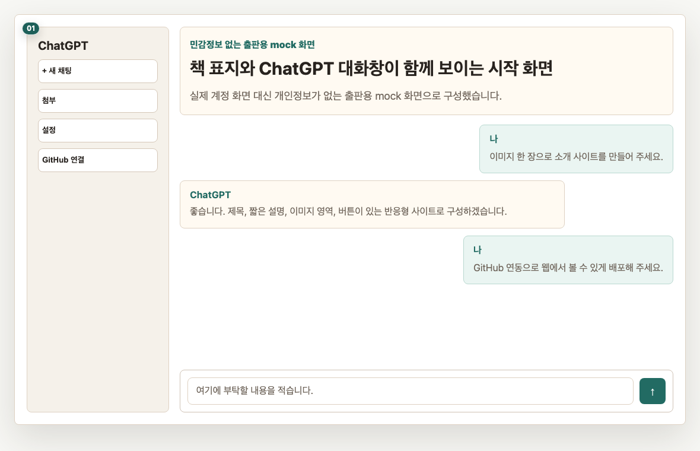
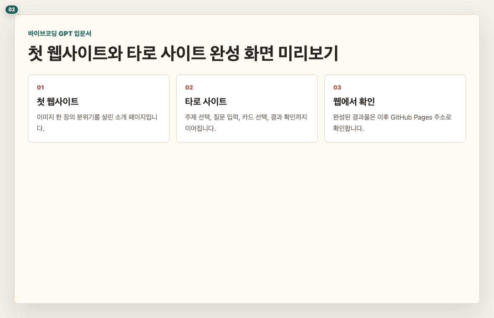
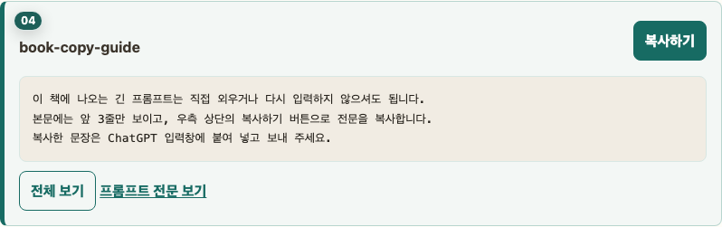
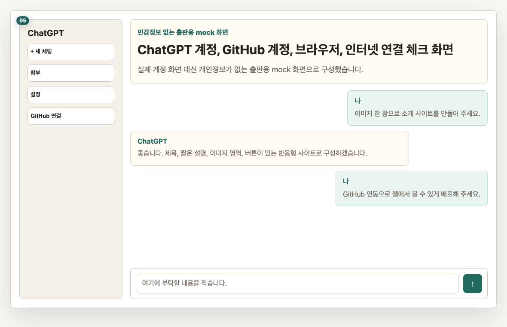

# 머리말. 이 책을 따라가기 전에

## 이 장의 목표

이 책을 어떻게 따라가면 되는지 먼저 확인합니다. 독자는 코딩 지식 없이도 ChatGPT 대화창에 부탁하고, 결과를 확인하고, 다시 부탁하는 흐름으로 웹에서 열리는 사이트 2개를 완성하게 됩니다.

## 페이지별 원고

### 1페이지. 이 책은 코딩 책이 아닙니다

이 책은 어려운 코딩 문법을 외우는 책이 아닙니다.  
ChatGPT에게 “이렇게 만들어 주세요”라고 부탁하고, 나온 결과를 보며 다시 고치는 책입니다.

독자 행동 안내: 먼저 이 책의 목표가 “코딩 공부”가 아니라 “완성 경험”이라는 점만 기억해 주세요.

### 2페이지. 책을 끝내면 남는 결과물 2개

끝까지 따라오시면 웹에서 열리는 사이트 2개가 남습니다.  
첫 번째는 이미지 한 장으로 만든 작은 웹사이트이고, 두 번째는 타로(tarot)카드 리딩 웹사이트입니다.

독자 행동 안내: 두 화면 중 어떤 사이트가 더 기대되는지 가볍게 살펴봐 주세요.

### 3페이지. 반응형 전자책으로 보는 방법

이 책은 휴대전화와 컴퓨터에서 모두 읽을 수 있게 구성합니다.  
화면이 작을 때는 이미지를 크게 보고, 프롬프트(prompt)는 복사하기 버튼으로 사용하시면 됩니다.

독자 행동 안내: 가능하면 컴퓨터에는 ChatGPT를 열고, 휴대전화에는 이 책을 열어 두시면 따라 하기 편합니다.

### 4페이지. 긴 프롬프트(prompt)는 복사해서 씁니다

책에 나오는 프롬프트(prompt)는 길 수 있습니다.  
그래서 본문에는 앞 3줄만 보여 주고, 우측 상단의 `복사하기` 버튼으로 전문을 복사하게 구성합니다.

> 프롬프트(prompt) 박스: book-copy-guide
> 표시: 앞 3줄 미리보기
> 버튼: 복사하기

독자 행동 안내: 프롬프트(prompt)를 직접 길게 타이핑하지 마시고, 복사해서 ChatGPT 입력창에 붙여 넣어 주세요.

### 5페이지. 시작 전 준비물 체크

준비물은 많지 않습니다.  
ChatGPT에 접속할 수 있고, GitHub 계정을 만들 수 있고, 인터넷 브라우저(browser)를 열 수 있으면 충분합니다.

독자 행동 안내: 아직 GitHub 계정이 없어도 괜찮습니다. Chapter 3에서 화면을 보며 함께 만들겠습니다.

## 이 장에서 확인할 것

- [ ] 이 책이 코딩 문법 책이 아니라는 점을 이해했습니다.
- [ ] 최종 결과물이 사이트 2개라는 점을 확인했습니다.
- [ ] 긴 프롬프트(prompt)는 복사하기 버튼으로 쓴다는 점을 확인했습니다.
- [ ] ChatGPT와 GitHub 계정이 필요하다는 점을 확인했습니다.
