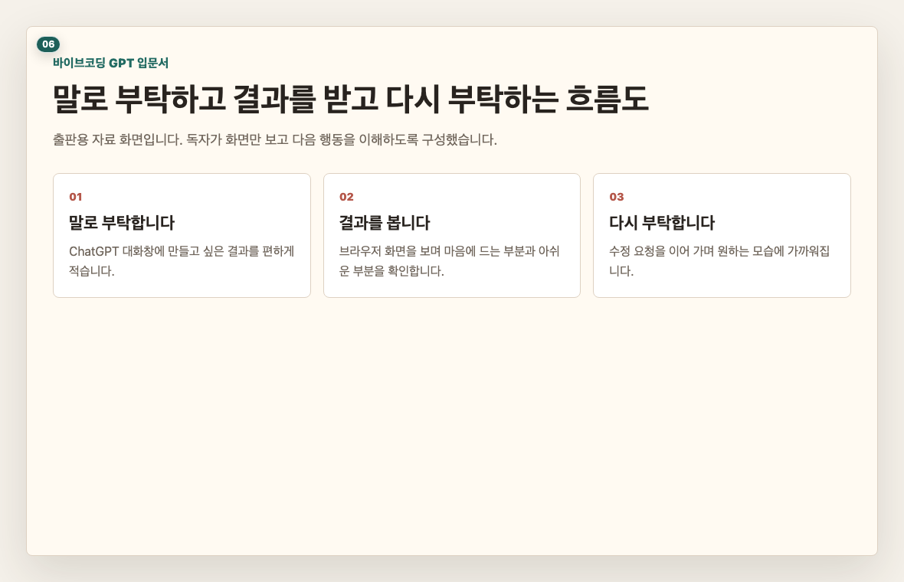
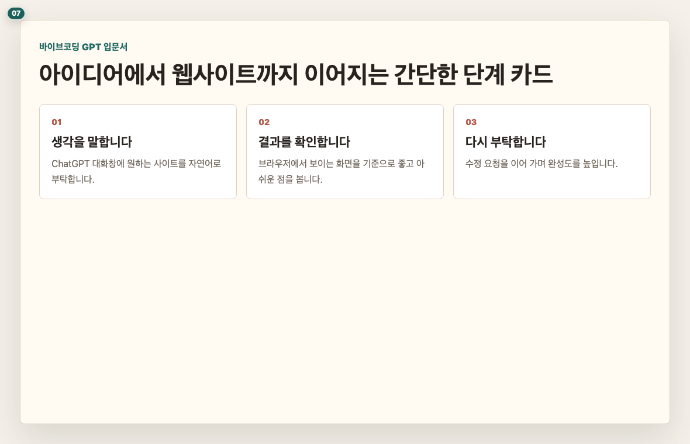
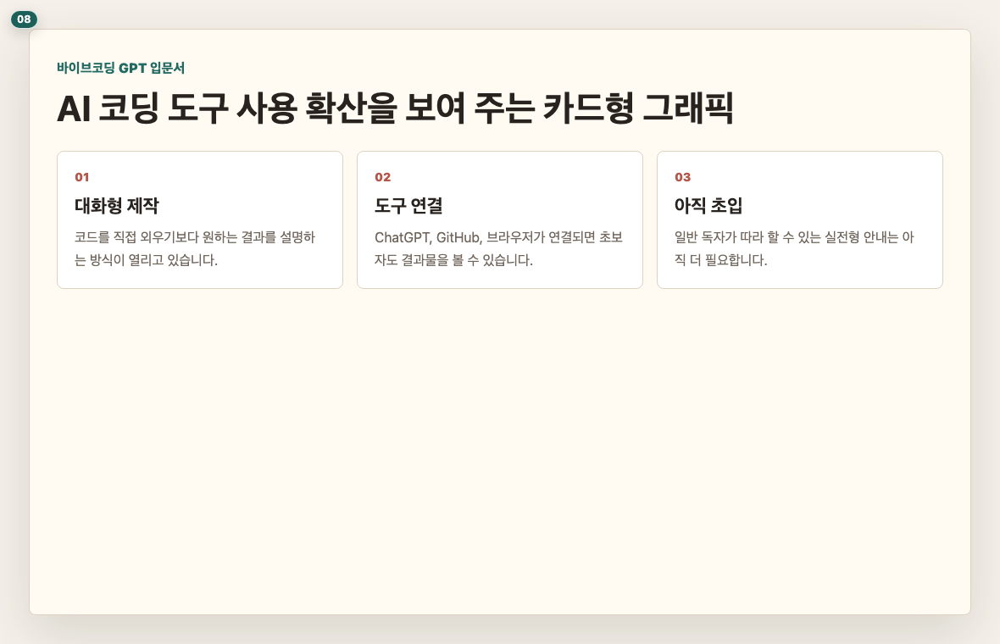
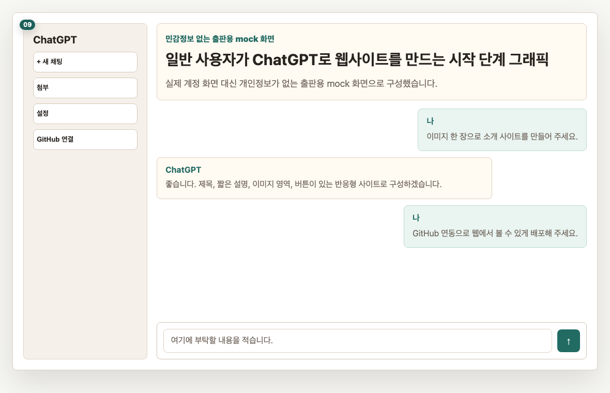
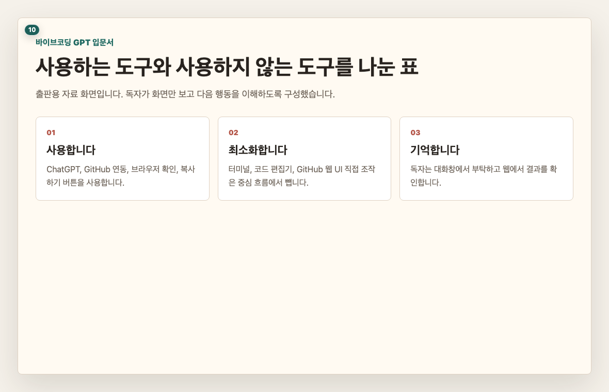
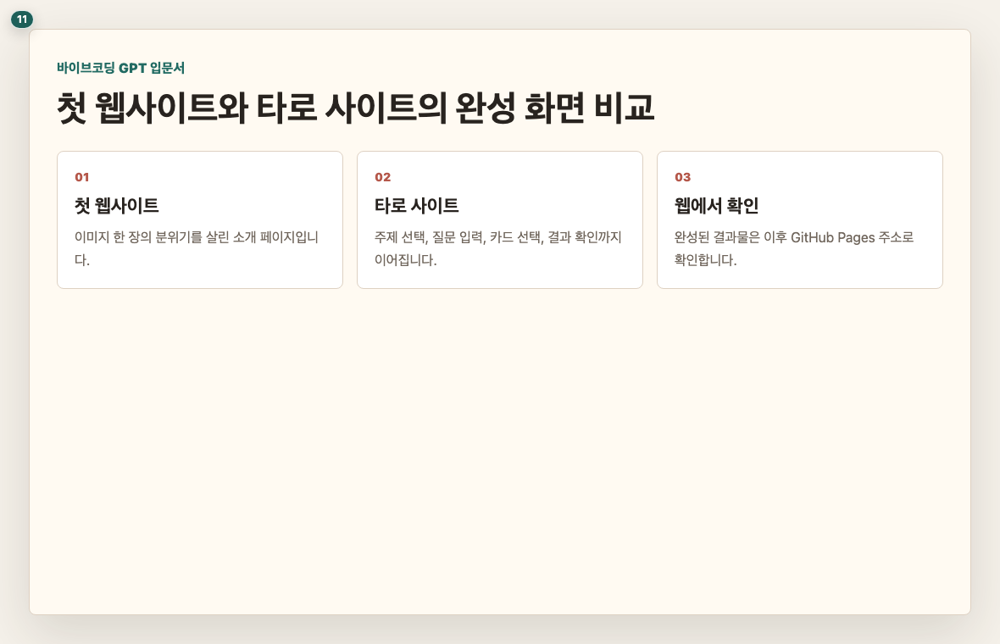
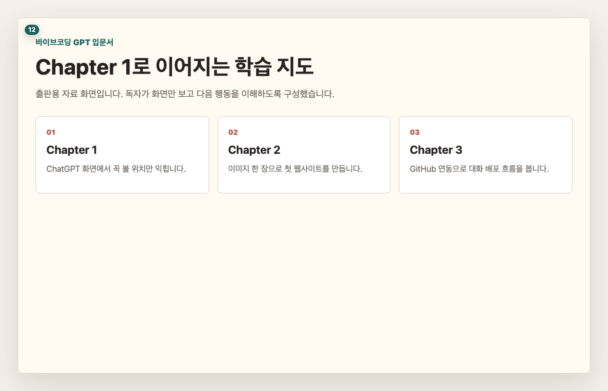

# Chapter 0. AI(Artificial Intelligence)와 바이브코딩(vibe coding), 지금 어디까지 왔나요

## 이 장의 목표

AI(Artificial Intelligence)에게 말로 부탁해서 결과물을 만드는 흐름을 이해합니다. 이 장에서는 시장 통계보다 독자가 “나도 해볼 수 있겠다”라고 느끼는 데 필요한 배경만 짧게 다룹니다.

## 페이지별 원고

### 1페이지. 말로 부탁하는 제작 방식

예전에는 웹사이트를 만들려면 코딩을 배워야 한다고 생각했습니다.  
이 책에서는 먼저 ChatGPT에게 원하는 모습을 말하고, 나온 결과를 보며 다시 부탁합니다.

독자 행동 안내: “정답 문장”을 외우려 하지 마시고, 부탁하고 고치는 흐름만 먼저 봐 주세요.

### 2페이지. 바이브코딩(vibe coding)이란 무엇인가요

바이브코딩(vibe coding)은 완벽한 설계도를 먼저 쓰는 방식이 아닙니다.  
원하는 분위기와 목적을 말하고, AI(Artificial Intelligence)가 만든 결과를 보며 방향을 잡는 제작 방식입니다.

독자 행동 안내: 오늘 만들고 싶은 사이트의 분위기를 한 단어로 떠올려 보세요.

### 3페이지. AI(Artificial Intelligence) 코딩 도구는 이미 퍼지고 있습니다

개발자들은 이미 AI(Artificial Intelligence) 도구를 많이 사용하고 있습니다.  
중요한 점은 “전문가만 쓰는 도구”였던 AI(Artificial Intelligence) 제작 방식이 점점 일반 사용자에게도 내려오고 있다는 점입니다.

독자 행동 안내: 이 페이지에서는 숫자를 외우지 않으셔도 됩니다. 흐름만 이해하시면 됩니다.

### 4페이지. 일반인의 웹 제작은 아직 초입입니다

웹서핑과 유튜브 정도만 하던 분들이 AI(Artificial Intelligence)로 웹사이트를 만드는 시장은 아직 초입입니다.  
그래서 지금 중요한 것은 멋진 이론보다 “한 번 끝까지 해 본 경험”입니다.

독자 행동 안내: 처음부터 완벽하게 만들려고 하지 마시고, 먼저 열리는 결과를 목표로 잡아 주세요.

### 5페이지. 이 책에서 쓰는 도구와 쓰지 않는 도구

이 책의 중심 도구는 ChatGPT 대화창입니다.  
GitHub 배포도 복잡한 화면 조작보다 ChatGPT와 GitHub를 연결한 뒤 대화로 부탁하는 흐름을 우선합니다.

독자 행동 안내: 낯선 도구 이름이 보여도 겁내지 마세요. 필요한 순간에 화면으로만 안내합니다.

### 6페이지. 이 책에서 만들 결과를 다시 봅니다

첫 번째 사이트는 작은 성공을 위한 연습입니다.  
두 번째 타로(tarot) 사이트는 화면 흐름이 있는 사이트를 만드는 본 실습입니다.

독자 행동 안내: 두 사이트 모두 “ChatGPT에게 부탁해서 만들고, 웹 주소로 열어 보는 것”이 목표입니다.

### 7페이지. 이제 ChatGPT 화면을 보겠습니다

배경은 이 정도면 충분합니다.  
다음 장부터는 실제 ChatGPT 대화창에서 어디를 눌러야 하는지 화면으로 확인하겠습니다.

독자 행동 안내: 다음 장을 보기 전에 ChatGPT에 로그인할 수 있는지만 확인해 주세요.

## 이 장에서 확인할 것

- [ ] 바이브코딩(vibe coding)이 말로 부탁하고 결과를 고치는 방식이라는 점을 이해했습니다.
- [ ] 이 책의 중심 도구가 ChatGPT 대화창이라는 점을 확인했습니다.
- [ ] 완성 경험이 이론보다 먼저라는 점을 확인했습니다.
- [ ] 다음 장에서 ChatGPT 화면을 볼 준비가 되었습니다.
