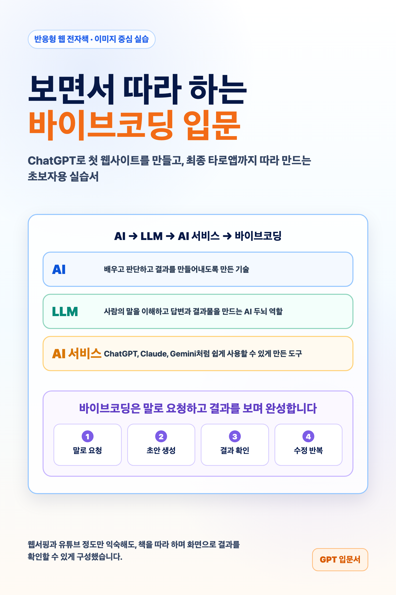
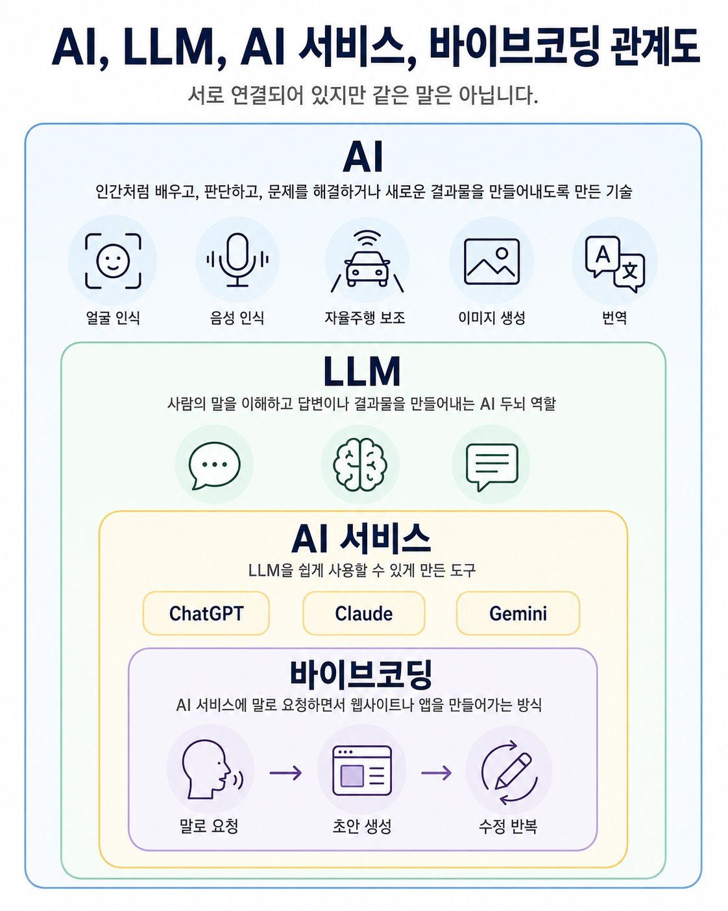
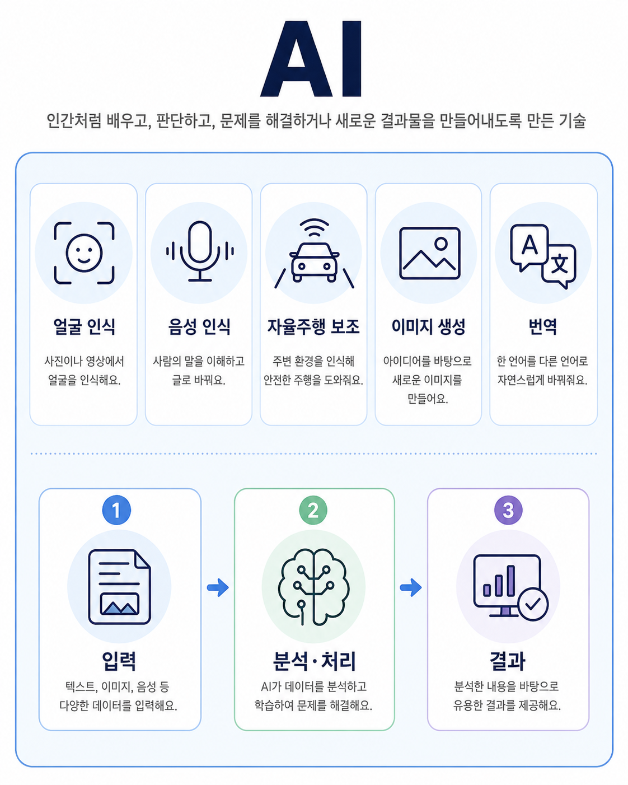
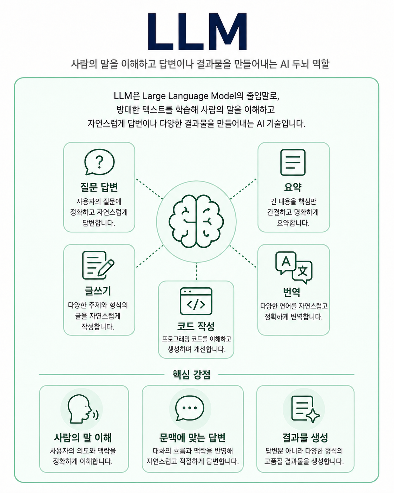
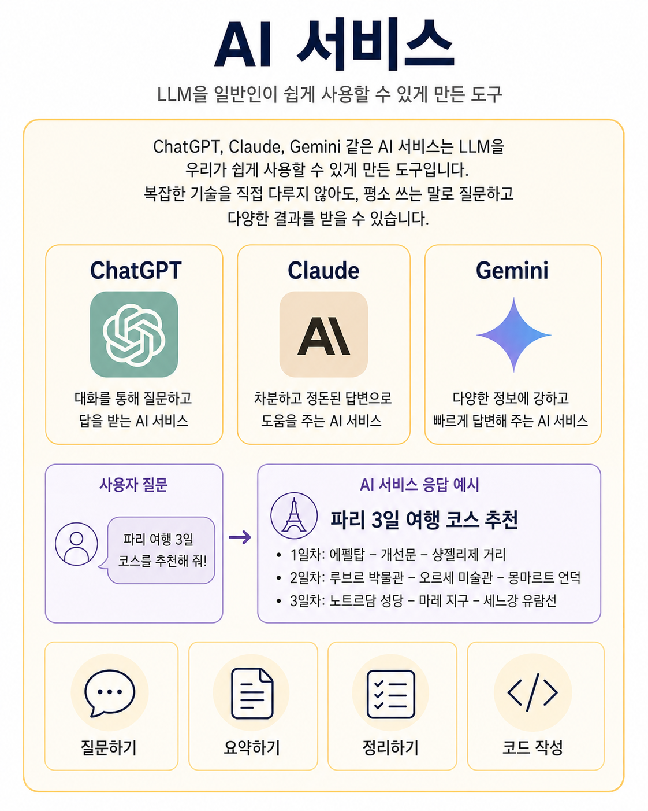
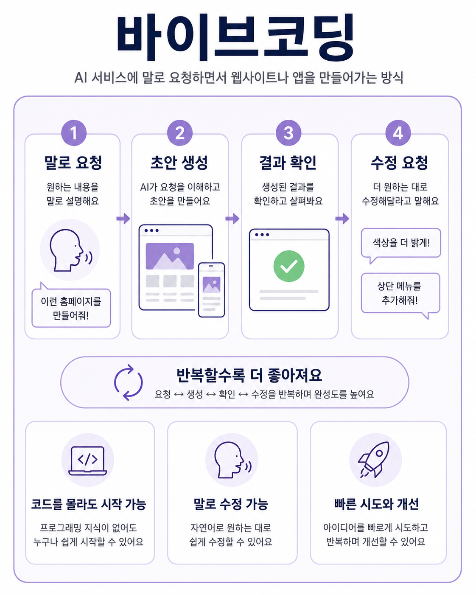

# Chapter 1. AI, LLM, AI 서비스, 바이브코딩 쉽게 이해하기

## AI, LLM, AI 서비스, 바이브코딩 관계도

AI, LLM, AI 서비스, 바이브코딩은 서로 연결되어 있습니다.
하지만 모두 같은 뜻은 아닙니다.

처음에는 아래 순서로 이해하면 됩니다.

AI는 가장 넓은 기술입니다.
얼굴 인식, 음성 인식, 자율주행 보조, 이미지 생성, 번역처럼 사람이 하던 일을 컴퓨터가 자동으로 처리하거나 도와주도록 만든 기술입니다.

LLM은 그중에서 사람의 말을 이해하고 답변이나 결과물을 만들어내는 AI 기술입니다.
우리가 글로 질문하면 내용을 이해하고, 글을 쓰거나 요약하거나 코드 같은 결과물까지 만들어냅니다.

AI 서비스는 이런 LLM을 일반인이 쉽게 사용할 수 있게 만든 도구입니다.
ChatGPT, Claude, Gemini 같은 서비스가 여기에 해당합니다.

바이브코딩은 AI 서비스에 말로 요청하면서 웹사이트나 앱을 만들어가는 방식입니다.
말로 요청하고, 결과를 확인하고, 다시 수정해 달라고 하면서 원하는 모습에 가까워지게 만듭니다.

- AI = 인간처럼 배우고 판단하고 결과를 만들어내도록 만든 기술
- LLM = 사람의 말을 이해하고 답변이나 결과물을 만들어내는 AI 두뇌 역할
- AI 서비스 = ChatGPT, Claude, Gemini처럼 LLM을 쉽게 사용할 수 있게 만든 도구
- 바이브코딩 = AI 서비스에 말로 요청하면서 웹사이트나 앱을 만들어가는 방식

## AI란?

AI는 인공지능이라고 부릅니다.
하지만 처음부터 어렵게 생각할 필요는 없습니다.

일상에서 이미 AI를 자주 만나고 있기 때문입니다.

스마트폰 사진 앱이 얼굴을 알아보는 것, 음성을 글자로 바꾸는 것, 자동차가 주변 상황을 인식해 운전을 돕는 것, 글을 바탕으로 이미지를 만드는 것, 외국어를 우리말로 바꿔주는 것 모두 AI와 관련이 있습니다.

AI는 어떤 정보를 입력받고, 그 안에서 의미를 찾고, 필요한 결과를 만들어냅니다.
사람이 직접 하던 판단이나 반복 작업을 컴퓨터가 자동으로 대신 처리하거나 도와주는 셈입니다.

중요한 점은 AI가 하나의 앱 이름이 아니라는 것입니다.
AI는 얼굴 인식, 음성 인식, 자율주행 보조, 이미지 생성, 번역처럼 여러 기술을 묶어 부르는 큰 이름입니다.

한 줄 정리입니다.
AI는 인간처럼 배우고 판단하고 결과를 만들어내도록 만든 기술입니다.

## LLM이란?

LLM은 Large Language Model의 줄임말입니다.
우리말로는 대형 언어 모델이라고 합니다.

말이 조금 어렵지만, 이 책에서는 이렇게 이해하면 충분합니다.

LLM은 사람의 말을 이해하고 답변이나 결과물을 만들어내는 AI 두뇌 역할입니다.

LLM은 사용자가 입력한 말을 읽고, 그 말의 뜻과 맥락을 파악합니다.
그다음 질문에 답하거나, 글을 쓰거나, 긴 내용을 요약하거나, 다른 언어로 번역하거나, 코드를 작성합니다.

예를 들어 이렇게 요청할 수 있습니다.

- “이 글을 짧게 요약해줘.”
- “여행 계획을 세워줘.”
- “쇼핑몰 소개 문구를 써줘.”
- “이 내용을 초보자도 이해하게 바꿔줘.”
- “이 웹페이지를 더 보기 좋게 고쳐줘.”

LLM이 중요한 이유는 우리가 평소 말하듯이 요청할 수 있다는 점입니다.
복잡한 명령어를 외우지 않아도, 원하는 내용을 말로 설명하면 결과를 받을 수 있습니다.

다만 LLM이 항상 완벽한 답을 주는 것은 아닙니다.
때로는 그럴듯하지만 틀린 답을 할 수도 있습니다.
그래서 중요한 내용은 사람이 확인하고 다듬어야 합니다.

한 줄 정리입니다.
LLM은 사람의 말을 이해하고 답변이나 결과물을 만들어내는 AI 두뇌 역할입니다.

## AI 서비스란?

AI 서비스는 LLM을 우리가 쉽게 사용할 수 있게 만든 도구입니다.

LLM 자체가 자동차의 엔진이라면, AI 서비스는 우리가 실제로 타고 움직일 수 있는 자동차에 가깝습니다.
복잡한 기술을 직접 다루지 않아도, 화면에 질문을 입력하고 답을 받을 수 있게 해줍니다.

ChatGPT, Claude, Gemini 같은 서비스가 대표적입니다.
이런 서비스에서는 평소 쓰는 말로 질문하고, 필요한 답변을 받을 수 있습니다.

예를 들어 여행 일정을 추천받을 수 있습니다.
긴 글을 요약할 수도 있습니다.
아이디어를 정리할 수도 있습니다.
웹사이트에 들어갈 글을 만들거나, 코드 작성을 도와달라고 할 수도 있습니다.

이 책에서 사용하는 흐름도 여기에 가깝습니다.
어려운 기술을 먼저 배우기보다, AI 서비스에 원하는 결과를 말하고 답을 받아 보면서 한 단계씩 만들어갑니다.

한 줄 정리입니다.
AI 서비스는 ChatGPT, Claude, Gemini처럼 LLM을 쉽게 사용할 수 있게 만든 도구입니다.

## 바이브코딩이란?

바이브코딩은 AI 서비스에 말로 요청하면서 웹사이트나 앱을 만들어가는 방식입니다.

예전에는 웹사이트나 앱을 만들려면 코딩 문법을 먼저 배워야 했습니다.
하지만 이제는 시작 방식이 달라졌습니다.

먼저 만들고 싶은 모습을 말합니다.
AI 서비스가 초안을 만들어줍니다.
그 결과를 보고 다시 수정해 달라고 요청합니다.

예를 들어 이렇게 말할 수 있습니다.

- “이런 홈페이지를 만들어줘.”
- “모바일에서도 잘 보이게 해줘.”
- “색상을 더 밝게 바꿔줘.”
- “상단 메뉴를 추가해줘.”
- “버튼을 더 눈에 띄게 만들어줘.”

바이브코딩은 한 번에 끝나는 작업이 아닙니다.
요청하고, 결과를 보고, 다시 말하면서 조금씩 원하는 모습에 가까워지는 과정입니다.

그래서 처음부터 코드를 모두 이해하지 못해도 시작할 수 있습니다.
물론 완성된 결과는 직접 확인해야 합니다.
AI 서비스가 만든 결과가 내가 원하는 기능과 화면에 맞는지 살펴보고, 부족한 부분은 다시 요청해야 합니다.

한 줄 정리입니다.
바이브코딩은 AI 서비스에 말로 요청하면서 웹사이트나 앱을 만들어가는 방식입니다.

## 정리

AI, LLM, AI 서비스, 바이브코딩은 한 줄로 이어집니다.

AI는 가장 큰 기술 범위입니다.
LLM은 그중에서 사람의 말을 이해하고 결과물을 만드는 AI 두뇌 역할입니다.
AI 서비스는 그 LLM을 우리가 쉽게 사용할 수 있게 만든 도구입니다.
바이브코딩은 그 AI 서비스에 말로 요청하면서 웹사이트나 앱을 만들어가는 방식입니다.

- AI = 인간처럼 배우고 판단하고 결과를 만들어내도록 만든 기술
- LLM = 사람의 말을 이해하고 답변이나 결과물을 만들어내는 AI 두뇌 역할
- AI 서비스 = ChatGPT, Claude, Gemini처럼 LLM을 쉽게 사용할 수 있게 만든 도구
- 바이브코딩 = AI 서비스에 말로 요청하면서 웹사이트나 앱을 만들어가는 방식

이 책은 바로 이 흐름을 따라갑니다.
먼저 AI 서비스와 대화하는 방법을 익히고, 그다음 웹사이트를 만들고, 마지막에는 타로앱까지 완성해볼 것입니다.
