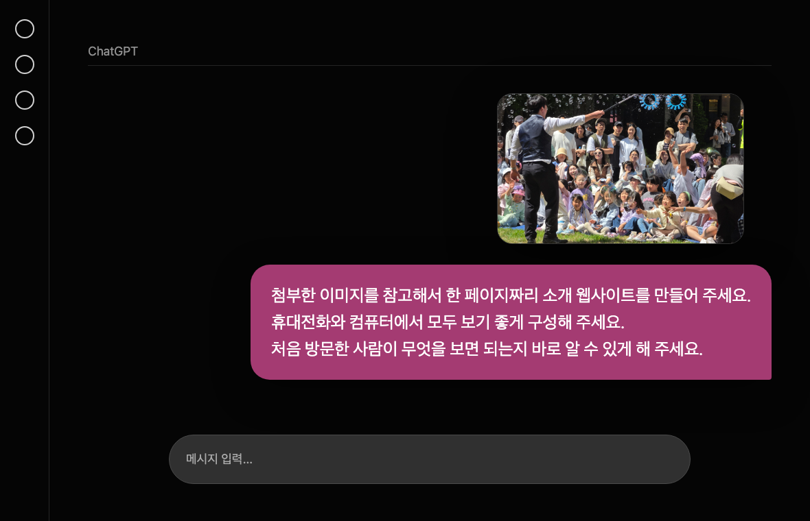
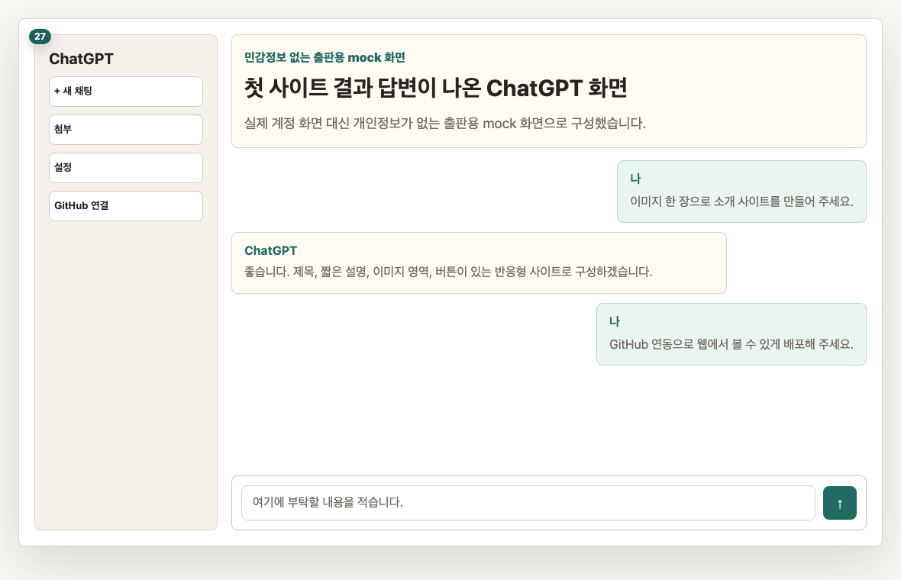
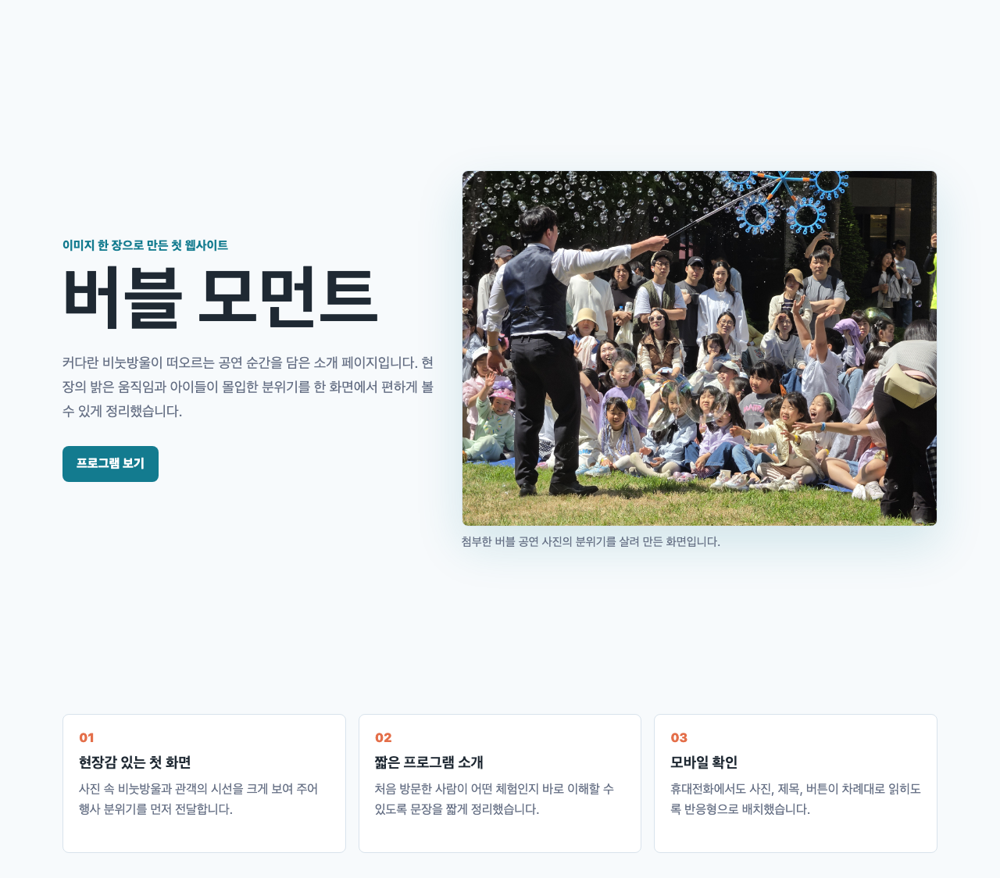
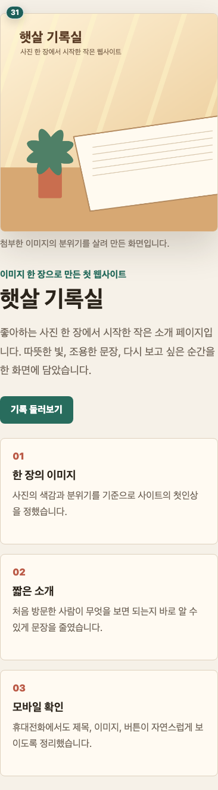
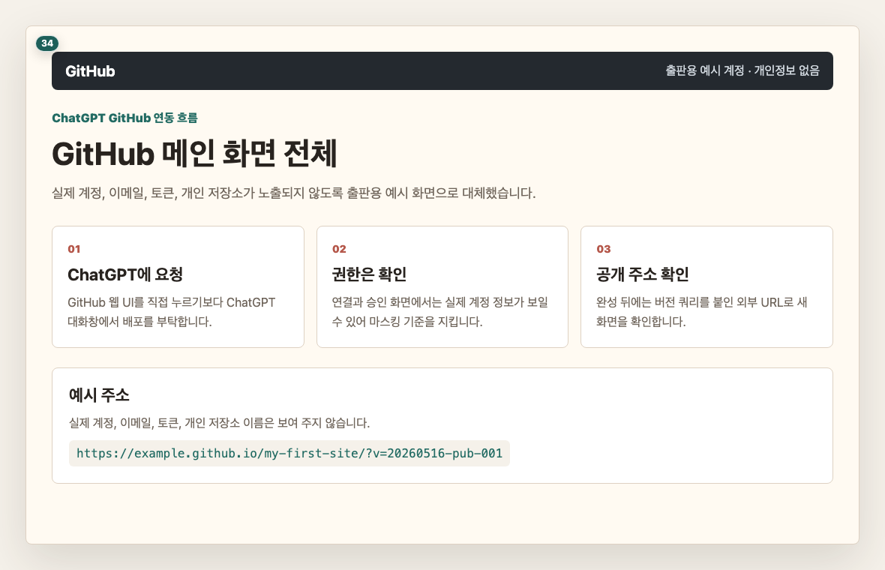
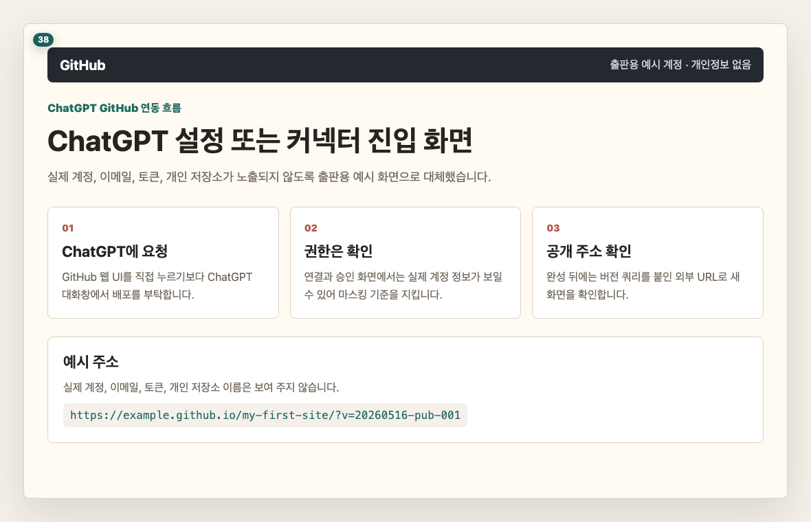
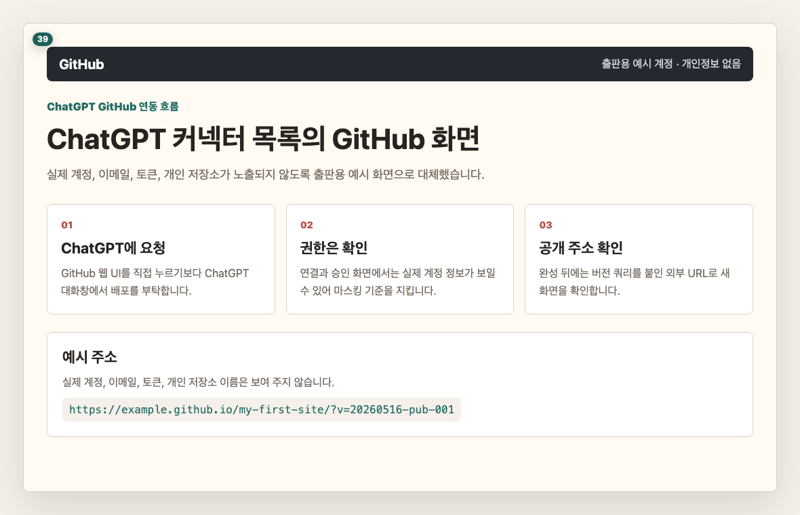
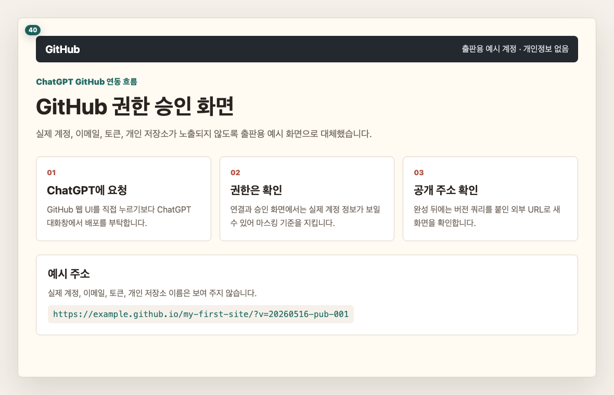
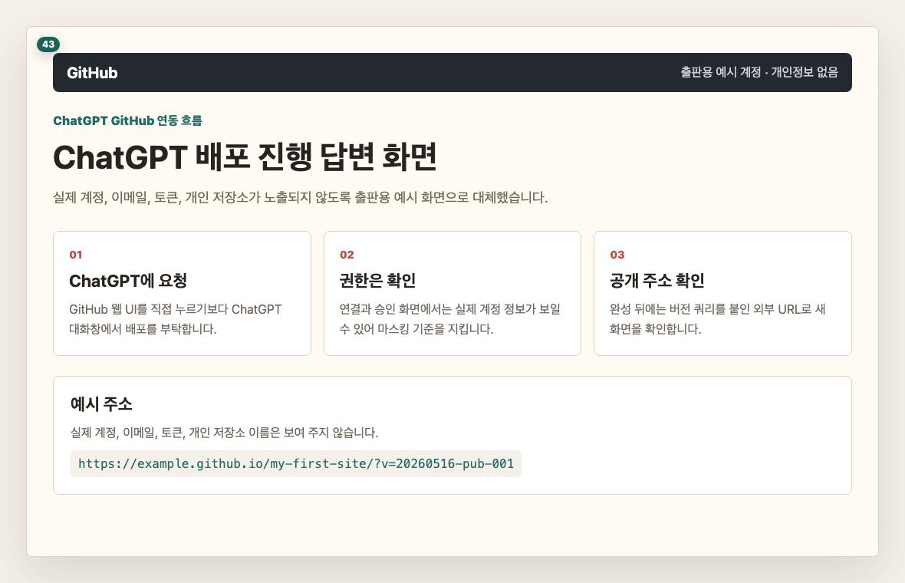
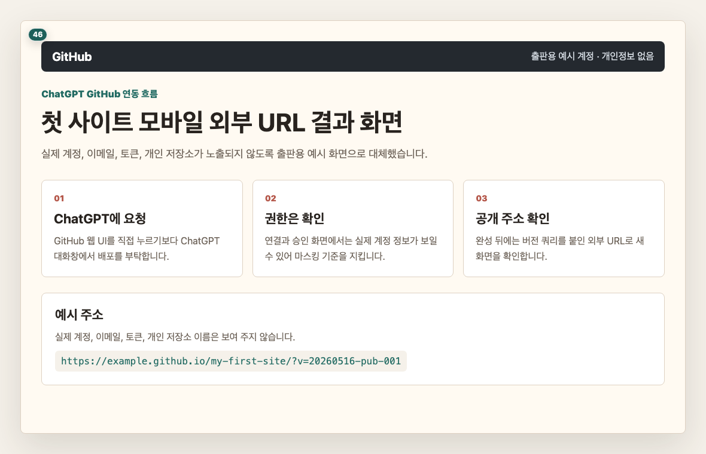

# Chapter 2. 이미지 하나로 웹사이트 만들고 배포합니다

## 이 장의 목표

이번 장에서는 이미지 하나를 ChatGPT에 넣고, 그 이미지와 어울리는 첫 웹사이트를 만듭니다.

그다음 ChatGPT와 GitHub를 연결해 결과를 웹 주소로 열 수 있게 배포합니다. 이 장을 끝내면 여러분은 “대화로 만든 결과가 실제 주소로 열리는 경험”을 하게 됩니다.

## 사용할 이미지 한 장을 고릅니다

처음에는 너무 복잡한 이미지보다 분위기가 분명한 이미지가 좋습니다.

카페, 여행지, 제품, 포스터처럼 한눈에 느낌이 보이는 이미지를 고릅니다.

## ChatGPT에 이미지를 첨부합니다

ChatGPT 입력창 옆의 첨부 단추를 눌러 이미지를 올립니다. 이미지가 올라오면 입력창 근처에 작은 미리보기가 보입니다.

개인정보가 보이는 화면은 출판용 캡처(capture)에서 가립니다. 여러분이 직접 따라 할 때는 본인의 계정 화면이 보여도 괜찮습니다.

## 첫 프롬프트(prompt)를 보냅니다

이제 ChatGPT에게 이미지를 바탕으로 웹사이트를 만들어 달라고 부탁합니다.

> 프롬프트(prompt) 박스: first-site
> 표시: 앞 3줄 미리보기
> 버튼: 복사하기

복사하기 버튼을 누른 뒤 ChatGPT 입력창에 붙여 넣고 보내 주세요.

## 결과가 나올 때까지 기다립니다

ChatGPT가 결과를 만드는 동안 잠시 기다립니다. 답변이 길게 나오더라도 정상입니다.

답변이 끝나면 ChatGPT가 만든 결과를 확인합니다. 코드처럼 보이는 내용이 나와도 직접 외우거나 고칠 필요는 없습니다.

## 실제 브라우저(browser) 결과를 확인합니다

첫 결과 화면이 보이면 성공입니다.

아직 디자인이 마음에 꼭 들지 않아도 괜찮습니다. 다음 단계에서 말로 고치면 됩니다.

결과 예시는 아래 주소에서도 확인할 수 있습니다.

- 첫 웹사이트 예시: [examples/first-site](../examples/first-site/)

## 한 줄로 수정 요청을 보냅니다

수정은 어렵게 말하지 않아도 됩니다.

“글자를 조금 크게 해 주세요”, “배경을 더 밝게 해 주세요”처럼 한 줄로 부탁하면 됩니다.

> 프롬프트(prompt) 박스: first-site-revise
> 표시: 앞 3줄 미리보기
> 버튼: 복사하기

수정 요청 뒤에는 결과가 어떻게 달라졌는지 봅니다.

## 모바일(mobile) 화면도 확인합니다

웹사이트는 컴퓨터에서만 예쁘면 부족합니다. 휴대전화에서도 글자가 잘 보이고 버튼을 누를 수 있어야 합니다.

제목, 이미지, 버튼이 잘리지 않는지 확인합니다.

## GitHub와 ChatGPT를 연결합니다

이제 첫 번째 사이트를 웹 주소로 열 수 있게 준비합니다.

GitHub는 만든 파일을 올려 두고 웹주소로 열 수 있게 도와주는 공간입니다. 이 책에서는 GitHub 화면을 깊게 배우기보다, ChatGPT와 연결해 대화로 배포하는 흐름을 사용합니다.

로그인은 구글(Google) 계정 기준으로 설명합니다. 이미 구글(Google) 계정으로 ChatGPT와 GitHub에 로그인되어 있다면 같은 흐름으로 확인하면 됩니다.

ChatGPT에서 GitHub 연결 위치를 찾습니다.

GitHub 연결을 선택하고 권한 화면을 확인합니다.

## 배포를 부탁합니다

연결이 끝나면 ChatGPT에게 첫 사이트를 GitHub Pages로 올려 달라고 부탁합니다.

> 프롬프트(prompt) 박스: github-deploy-first
> 표시: 앞 3줄 미리보기
> 버튼: 복사하기

배포 과정은 시간이 조금 걸릴 수 있습니다. ChatGPT가 저장소를 만들고 파일을 올리고 Pages 설정을 안내하거나 진행합니다.

## 배포 URL(Uniform Resource Locator)을 확인합니다

성공하면 ChatGPT 답변 안에 웹주소가 보입니다. 보통 `https://...github.io/...` 형태의 주소입니다.

주소가 열리고 첫 번째 사이트가 보이면 배포 성공입니다.

같은 주소를 휴대전화에서도 열어 봅니다.

## 이 장에서 확인할 것

- 이미지 한 장을 ChatGPT에 첨부했습니다.
- 첫 사이트 제작 프롬프트(prompt)를 복사해 보냈습니다.
- 첫 웹사이트 결과 화면을 확인했습니다.
- 한 줄 수정 요청을 보내 봤습니다.
- GitHub와 ChatGPT 연결 흐름을 확인했습니다.
- 배포 URL(Uniform Resource Locator)을 데스크톱(desktop)과 모바일(mobile) 기준으로 확인했습니다.
