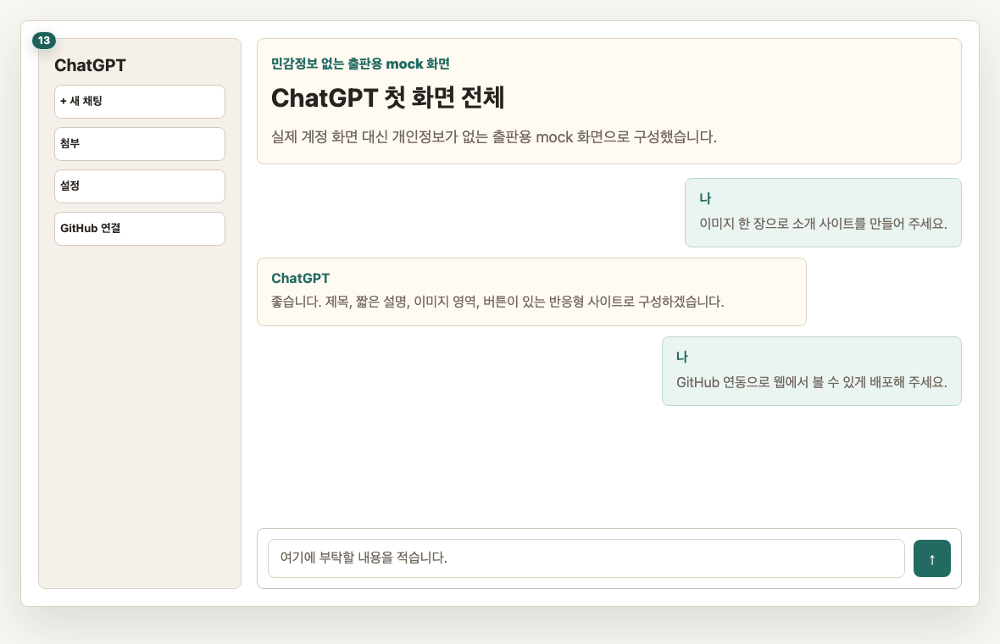
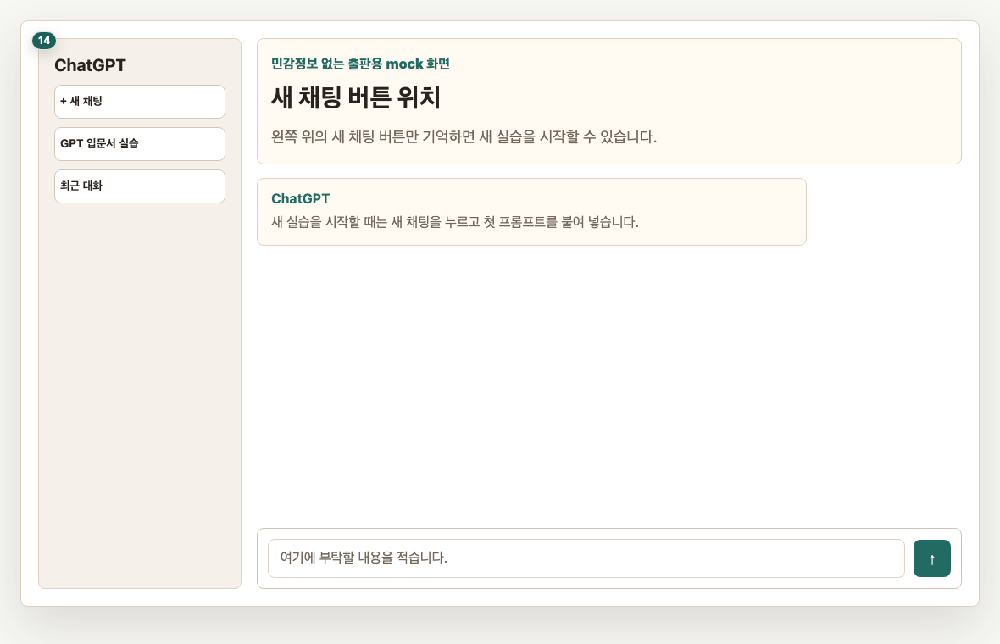
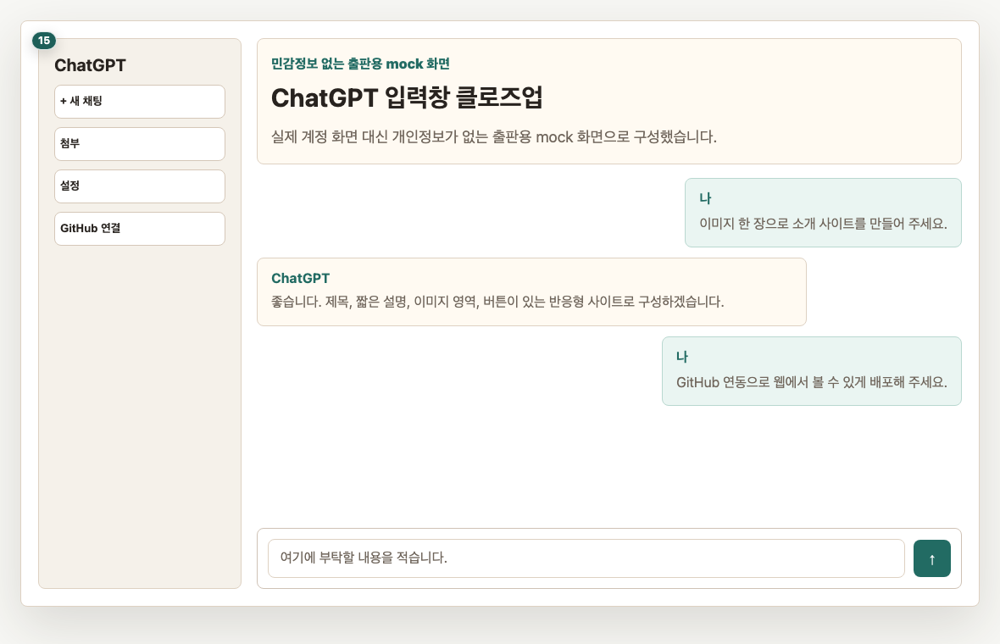
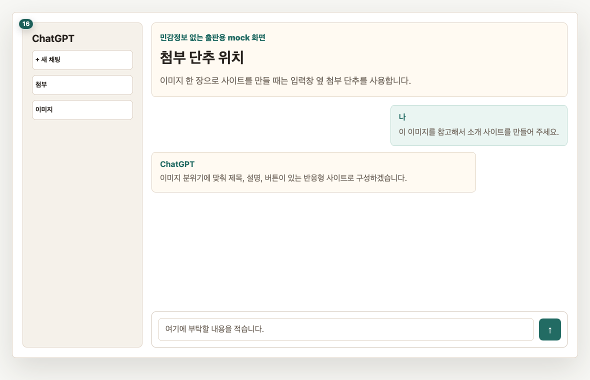
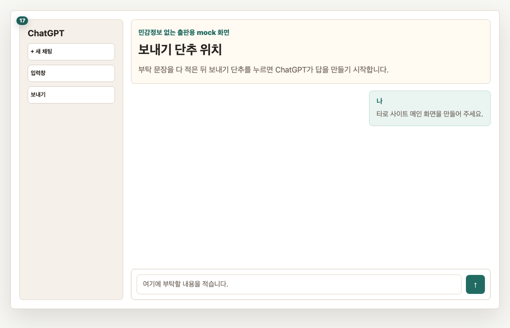
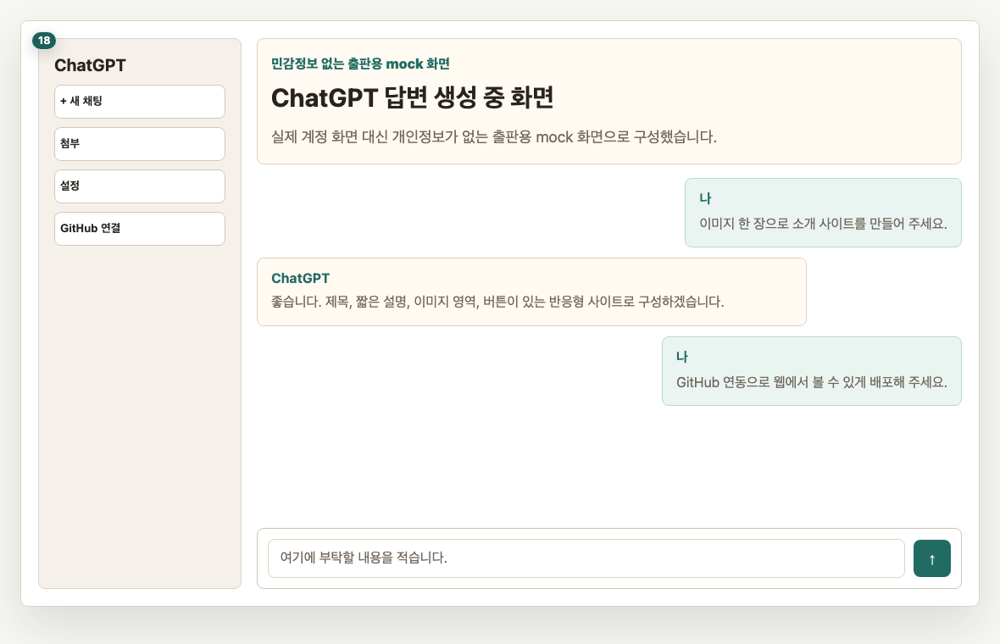
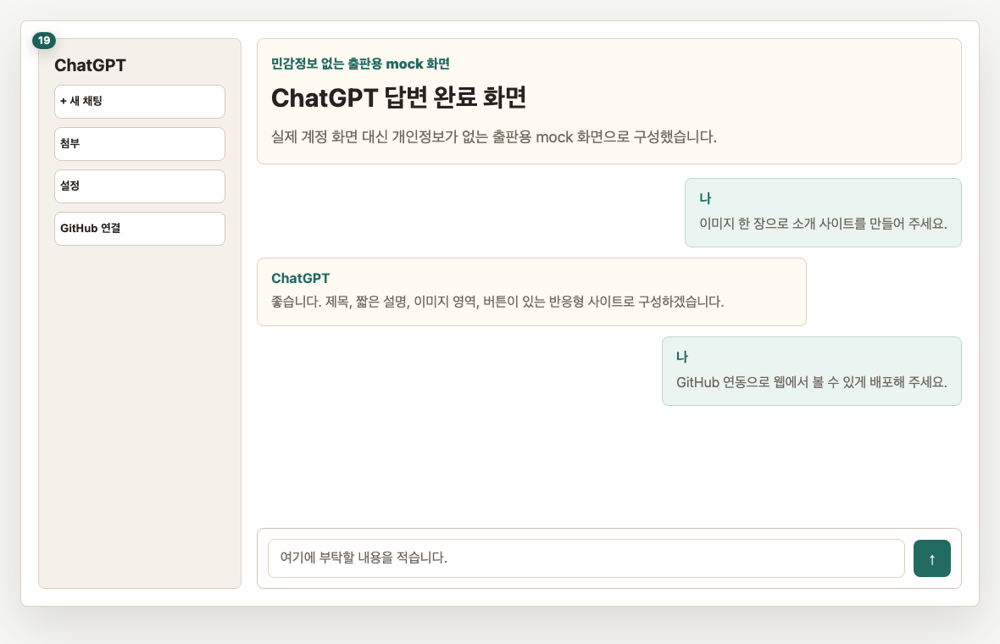
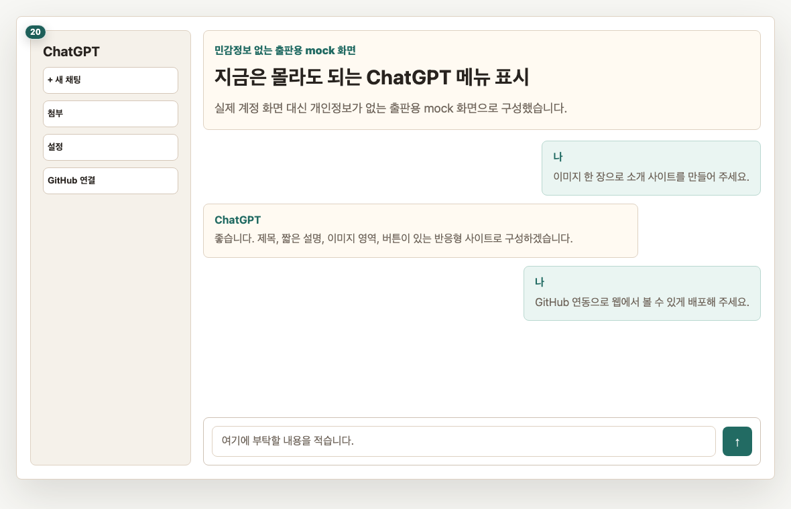
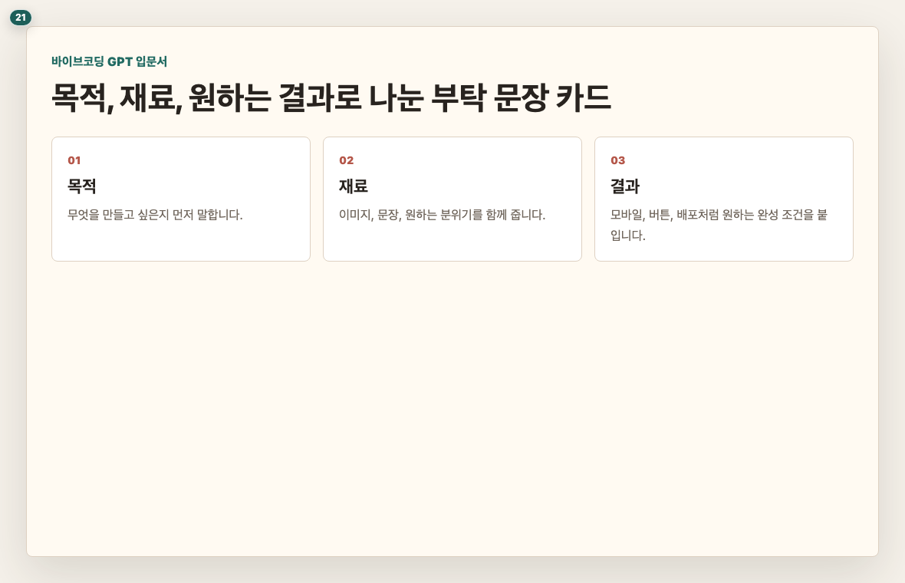

# Chapter 1. ChatGPT 대화창 알아보기

## 이 장의 목표

ChatGPT 대화창에서 실습에 꼭 필요한 위치만 익힙니다. 처음에는 모든 메뉴를 알 필요가 없습니다.

## 페이지별 원고

### 1페이지. ChatGPT 첫 화면 전체 보기

처음 화면은 복잡해 보여도 실제로 자주 쓰는 곳은 많지 않습니다.  
이 책에서는 입력창, 첨부 단추, 보내기 단추, 답변 영역만 먼저 사용합니다.

독자 행동 안내: 화면 전체를 한 번 훑어보고, 아래쪽 입력창 위치만 찾아 주세요.

### 2페이지. 새 채팅은 새 종이입니다

새 채팅은 새 종이를 꺼내는 것과 비슷합니다.  
새로운 실습을 시작하거나 대화가 너무 길어졌을 때 사용합니다.

독자 행동 안내: 지금은 새 채팅 버튼 위치만 확인해 주세요.

### 3페이지. 입력창에 부탁할 내용을 씁니다

입력창은 ChatGPT에게 부탁할 내용을 쓰는 자리입니다.  
짧게 써도 되고, 복사한 프롬프트를 붙여 넣어도 됩니다.

독자 행동 안내: 입력창에 커서를 한 번 올려 보세요. 아직 보내지 않아도 됩니다.

### 4페이지. 첨부 단추로 이미지를 올립니다

이미지 한 장으로 웹사이트를 만들 때는 첨부 단추를 사용합니다.  
사진이나 그림을 올리면 ChatGPT가 그 이미지를 참고해서 사이트 분위기를 잡을 수 있습니다.

독자 행동 안내: 첨부 단추가 어디에 있는지 확인해 주세요.

### 5페이지. 보내기 단추는 실행 버튼입니다

문장을 다 썼다면 보내기 단추를 누릅니다.  
이 버튼을 누르면 ChatGPT가 요청을 읽고 답변을 만들기 시작합니다.

독자 행동 안내: 보내기 단추 위치만 확인하고, 실습에서는 프롬프트를 붙여 넣은 뒤 누르겠습니다.

### 6페이지. 답변이 나오는 동안 기다립니다

답변이 길면 몇 초에서 몇 분 정도 걸릴 수 있습니다.  
중간에 멈춘 것처럼 보여도 조금 기다리면 이어서 나오는 경우가 많습니다.

독자 행동 안내: 답변이 끝나기 전에 같은 요청을 여러 번 보내지 않도록 해 주세요.

### 7페이지. 답변 완료 화면을 봅니다

답변이 끝나면 결과를 읽고 다음 행동을 정합니다.  
마음에 들면 다음 단계로 가고, 마음에 들지 않으면 다시 고쳐 달라고 부탁하면 됩니다.

독자 행동 안내: 답변 아래쪽에 다시 입력할 수 있는 자리가 있는지 확인해 주세요.

### 8페이지. 처음에는 몰라도 되는 메뉴들

처음부터 모든 메뉴를 이해하려고 하면 실습이 느려집니다.  
이 책에서는 필요한 순간에 필요한 메뉴만 화면으로 다시 안내합니다.

독자 행동 안내: 모르는 버튼이 있어도 멈추지 말고, 책에서 번호가 붙은 곳만 따라가 주세요.

### 9페이지. 좋은 부탁 문장의 기본 구조

좋은 부탁 문장은 보통 세 가지를 담습니다.  
무엇을 만들지, 어떤 자료를 참고할지, 어떤 느낌이면 좋은지를 말하면 됩니다.

> 프롬프트 박스: prompt-basic-structure
> 표시: 앞 3줄 미리보기
> 버튼: 복사하기

독자 행동 안내: 다음 장에서는 이 구조로 첫 번째 웹사이트를 만들겠습니다.

## 이 장에서 확인할 것

- [ ] ChatGPT 입력창 위치를 찾았습니다.
- [ ] 첨부 단추 위치를 찾았습니다.
- [ ] 보내기 단추 위치를 찾았습니다.
- [ ] 답변이 나오면 기다려야 한다는 점을 확인했습니다.
- [ ] 모든 메뉴를 처음부터 알 필요가 없다는 점을 확인했습니다.
