# Chapter 4. 두 번째 실습 준비 - 타로 사이트는 어떻게 생겼나요

## 이 장의 목표

타로 사이트를 만들기 전에 완성 화면과 사용자 흐름을 먼저 봅니다. 독자가 만들 결과를 알고 시작해야 긴 실습을 안정적으로 따라갈 수 있습니다.

## 페이지별 원고

### 1페이지. 타로 사이트 완성 화면 미리보기

두 번째 실습에서는 타로카드 리딩 사이트를 만듭니다.  
사용자가 주제를 고르고, 질문을 적고, 카드를 뽑으면 결과를 보여 주는 흐름입니다.

독자 행동 안내: 지금은 기능을 외우지 말고 전체 분위기만 봐 주세요.

### 2페이지. 메인 화면 보기

메인 화면은 사이트에 처음 들어왔을 때 보이는 자리입니다.  
무엇을 하는 사이트인지 바로 알 수 있어야 합니다.

독자 행동 안내: 제목, 짧은 설명, 시작 버튼이 보이는지 확인해 주세요.

### 3페이지. 주제 선택 화면 보기

타로 리딩은 주제에 따라 답변 느낌이 달라집니다.  
예를 들어 오늘의 운세, 연애, 일, 선택 고민 같은 주제를 고를 수 있습니다.

독자 행동 안내: 독자가 누르기 쉬운 선택지가 몇 개 보이는지 살펴봐 주세요.

### 4페이지. 질문 입력 화면 보기

질문 입력 화면에서는 사용자가 궁금한 내용을 적습니다.  
너무 긴 질문보다 한 문장 정도가 처음에는 적당합니다.

독자 행동 안내: 입력칸과 다음 버튼이 한눈에 보이는지 확인해 주세요.

### 5페이지. 카드 뽑기 화면 보기

카드 뽑기 화면은 이 사이트에서 가장 재미있는 부분입니다.  
사용자는 카드를 고르고, 선택한 카드가 결과에 반영되는 느낌을 받습니다.

독자 행동 안내: 카드가 너무 작지 않은지, 누를 수 있어 보이는지 확인해 주세요.

### 6페이지. 결과 보기 화면 보기

결과 화면에서는 선택한 카드와 해석을 보여 줍니다.  
이 화면이 읽기 편해야 사용자가 사이트를 완성된 서비스처럼 느낍니다.

독자 행동 안내: 카드 이름, 해석 문장, 다시 보기 버튼이 보이는지 확인해 주세요.

### 7페이지. 제작 순서 지도

다음 장에서는 카드 이미지를 준비하고, 그다음 장에서 화면을 하나씩 만들겠습니다.  
완성 화면을 미리 봤으니 이제 필요한 재료를 준비할 차례입니다.

독자 행동 안내: 메인, 주제 선택, 질문 입력, 카드 뽑기, 결과 화면 순서를 기억해 주세요.

## 이 장에서 확인할 것

- [ ] 타로 사이트가 어떤 흐름인지 확인했습니다.
- [ ] 메인 화면과 주제 선택 화면을 봤습니다.
- [ ] 질문 입력과 카드 뽑기 화면을 봤습니다.
- [ ] 결과 화면이 최종 목적지라는 점을 이해했습니다.
- [ ] 다음 장에서 카드 이미지를 준비한다는 점을 확인했습니다.
# Chapter 5. 타로카드 이미지는 어떻게 준비하나요

## 이 장의 목표

타로 사이트에 필요한 카드 이미지 준비 방식을 정합니다. 이미지 생성 한도 때문에 독자가 중간에 막히지 않도록, 책에서는 샘플 2장만 직접 만들어 보고 나머지는 제공 자료를 사용합니다.

## 페이지별 원고

### 1페이지. 이 책에서는 메이저 22장으로 시작합니다

타로카드는 전체 구성이 더 넓지만, 이 책의 첫 실습은 메이저 22장으로 시작합니다.  
처음부터 모든 카드를 다루기보다, 22장 안에서 질문, 선택, 결과 흐름을 먼저 완성합니다.

독자 행동 안내: 이 책에서는 메이저 22장 기준으로 타로 사이트의 핵심 흐름을 먼저 만든다는 점을 확인해 주세요.

### 2페이지. 이미지 생성에는 한도가 있습니다

이미지 생성은 계정 상태와 시점에 따라 사용할 수 있는 횟수가 다릅니다.  
그래서 이 책은 샘플 2장만 직접 만들어 감각을 익히고, 나머지는 제공 자료를 사용합니다.

독자 행동 안내: 이미지 생성이 막혀도 실습 전체가 멈추지 않도록 진행하겠습니다.

### 3페이지. 샘플 카드 1 만들기

첫 번째 샘플 카드는 타로 사이트의 분위기를 잡는 용도입니다.  
프롬프트 전문은 Phase 3에서 정리하고, 여기서는 복사 박스 자리만 둡니다.

> 프롬프트 박스: tarot-card-sample-1
> 표시: 앞 3줄 미리보기
> 버튼: 복사하기

독자 행동 안내: 복사하기 버튼으로 프롬프트를 보내고 결과 이미지를 기다려 주세요.

### 4페이지. 샘플 카드 1 결과 확인

결과 이미지는 완벽하지 않아도 괜찮습니다.  
분위기, 색감, 카드 테두리 느낌이 사이트와 어울리는지만 먼저 봅니다.

독자 행동 안내: 마음에 드는 부분과 아쉬운 부분을 한 가지씩 찾아보세요.

### 5페이지. 샘플 카드 2 만들기

두 번째 샘플 카드는 같은 스타일이 유지되는지 확인하는 용도입니다.  
스타일이 크게 흔들리면 나중에 카드들이 서로 다른 사이트처럼 보일 수 있습니다.

> 프롬프트 박스: tarot-card-sample-2
> 표시: 앞 3줄 미리보기
> 버튼: 복사하기

독자 행동 안내: 두 번째 카드도 같은 분위기로 생성되는지 확인해 주세요.

### 6페이지. 샘플 카드 2 결과 확인

두 카드가 완전히 같을 필요는 없습니다.  
하지만 같은 타로 세트처럼 보이는 정도의 통일감은 있어야 합니다.

독자 행동 안내: 두 장을 나란히 보고 색감과 테두리 스타일이 비슷한지 확인해 주세요.

### 7페이지. 나머지는 제공 자료를 사용합니다

실제 사이트에는 여러 카드 이미지가 필요합니다.  
이번 확인본은 제공된 카드 이미지와 카드 뒷면 UI를 함께 사용해 22장 선택 구조를 먼저 완성합니다.

독자 행동 안내: 제공 자료 폴더가 어디에 연결될 예정인지 확인해 주세요.

### 8페이지. 이미지가 깨지지 않게 확인합니다

카드 이미지가 깨져 보이면 사이트 완성도가 크게 떨어집니다.  
다음 장에서 타로 사이트를 만들 때는 카드가 정상 표시되는지 계속 확인하겠습니다.

독자 행동 안내: 깨진 이미지 아이콘이 보이면 부록의 재요청 문장을 사용하면 됩니다.

## 이 장에서 확인할 것

- [ ] 이 책의 실습이 메이저 22장 기준으로 진행된다는 점을 확인했습니다.
- [ ] 이미지 생성 한도 때문에 샘플 2장만 직접 만든다는 점을 이해했습니다.
- [ ] 제공 자료를 사용하는 이유를 확인했습니다.
- [ ] 카드 이미지 깨짐은 출고 전 반드시 잡아야 한다는 점을 확인했습니다.
# Chapter 6. 두 번째 사이트 만들기 - 타로 사이트

## 이 장의 목표

ChatGPT 대화창에서 타로 사이트를 화면별로 완성합니다. 각 단계는 이미지 자리, 프롬프트 박스 자리, 결과 확인으로 구성합니다.

## 페이지별 원고

### 1페이지. 타로 사이트 제작 흐름 전체 보기

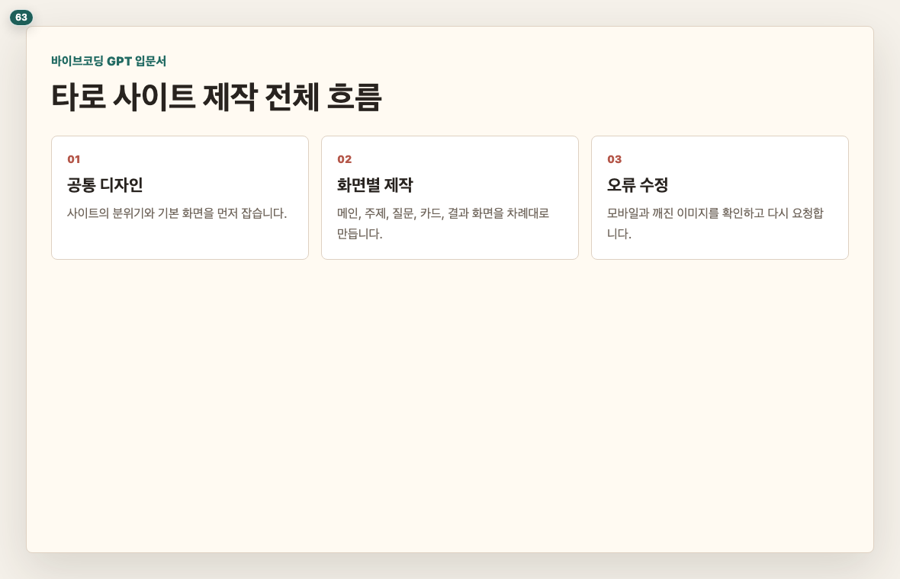

이번 장은 가장 긴 실습입니다.  
메인 화면부터 결과 화면까지 한 번에 만들려고 하지 않고, 화면을 나누어 부탁합니다.

독자 행동 안내: 메인, 주제, 질문, 카드, 결과 순서만 먼저 확인해 주세요.

### 2페이지. 공통 디자인 약속 정하기

먼저 사이트 전체 분위기를 정합니다.  
색감, 글자 느낌, 카드 분위기를 한 번 정해 두면 뒤 화면들이 더 자연스럽게 이어집니다.

> 프롬프트 박스: tarot-design
> 표시: 앞 3줄 미리보기
> 버튼: 복사하기

독자 행동 안내: 복사한 프롬프트를 ChatGPT에 보내고 디자인 방향 답변을 받아 주세요.

### 3페이지. 디자인 결과 확인하기

디자인 답변에서는 색상, 분위기, 버튼 스타일을 봅니다.  
마음에 들지 않으면 아직 늦지 않았습니다. 지금 고치면 뒤 화면도 편해집니다.

독자 행동 안내: 너무 어둡거나 글자가 잘 안 보이면 밝게 조정해 달라고 부탁해 주세요.

### 4페이지. 메인 화면 만들기

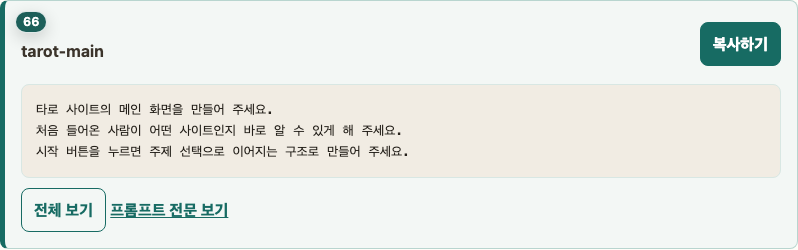

메인 화면은 사용자가 처음 만나는 화면입니다.  
무엇을 하는 사이트인지 바로 알 수 있게 만들어 달라고 부탁합니다.

> 프롬프트 박스: tarot-main
> 표시: 앞 3줄 미리보기
> 버튼: 복사하기

독자 행동 안내: 프롬프트를 보내고 메인 화면 결과를 기다려 주세요.

### 5페이지. 메인 화면 결과 확인

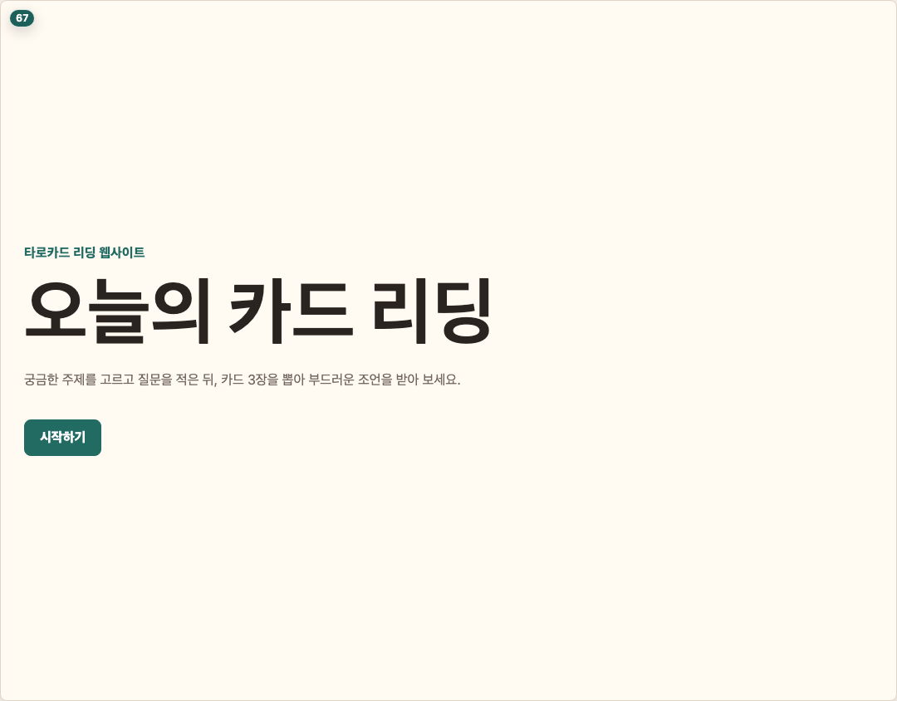

메인 화면에는 제목, 짧은 설명, 시작 버튼이 보여야 합니다.  
첫 화면에서 사용자가 무엇을 하면 되는지 알 수 있어야 합니다.

독자 행동 안내: 시작 버튼이 잘 보이는지 확인해 주세요.

### 6페이지. 주제 선택 화면 만들기

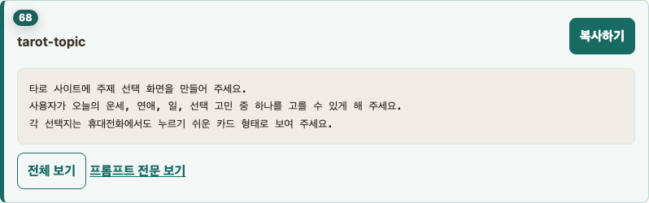

이제 사용자가 리딩 주제를 고를 수 있게 만듭니다.  
선택지는 너무 많지 않게 시작하는 편이 좋습니다.

> 프롬프트 박스: tarot-topic
> 표시: 앞 3줄 미리보기
> 버튼: 복사하기

독자 행동 안내: 복사한 프롬프트를 보내고 주제 선택 결과를 확인해 주세요.

### 7페이지. 주제 선택 결과 확인

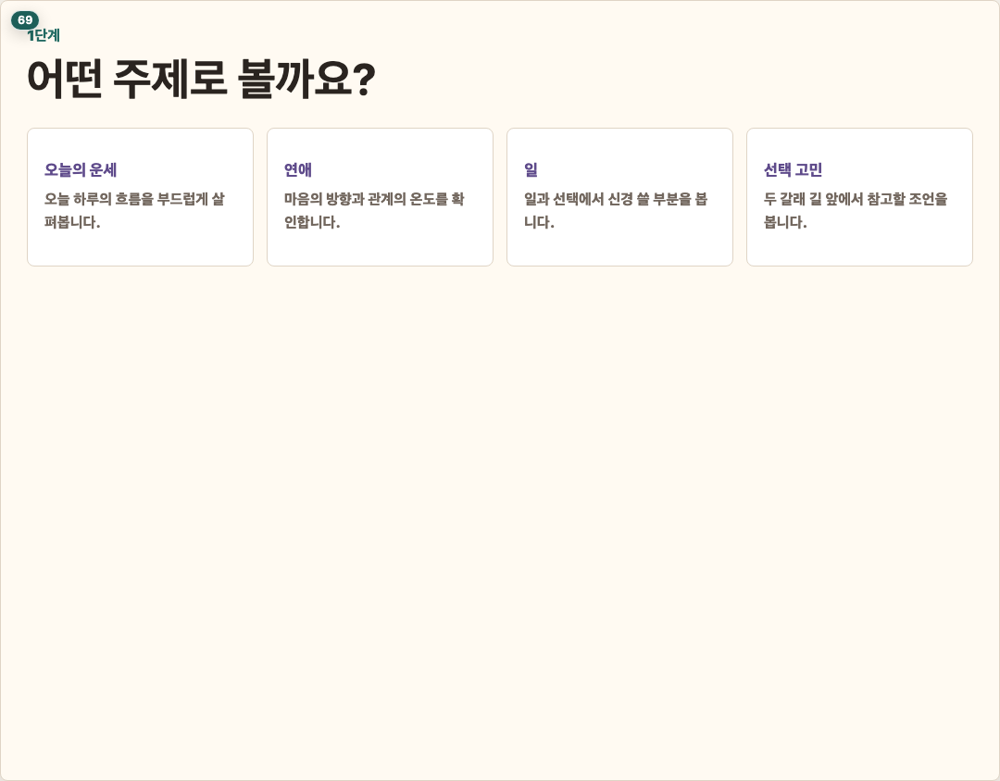

주제 선택 화면은 누를 수 있어 보이는 카드나 버튼으로 구성합니다.  
글자가 작거나 선택지가 너무 붙어 있으면 모바일에서 불편합니다.

독자 행동 안내: 휴대전화에서도 선택지가 눌릴 만큼 큰지 확인해 주세요.

### 8페이지. 질문 입력 화면 만들기

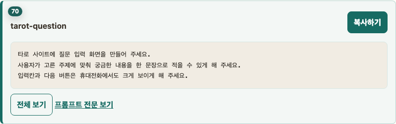

질문 입력 화면에서는 사용자가 자신의 고민을 적습니다.  
입력칸과 다음 버튼이 명확해야 합니다.

> 프롬프트 박스: tarot-question
> 표시: 앞 3줄 미리보기
> 버튼: 복사하기

독자 행동 안내: 질문 입력 화면을 만들어 달라고 ChatGPT에 부탁해 주세요.

### 9페이지. 질문 입력 결과 확인

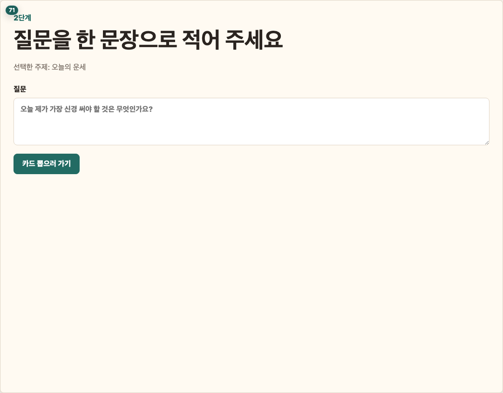

입력칸은 너무 작으면 안 됩니다.  
안내 문장은 짧고 부드럽게 보여야 합니다.

독자 행동 안내: 실제로 짧은 질문을 입력해 볼 수 있는 화면인지 확인해 주세요.

### 10페이지. 카드 뽑기 화면 만들기

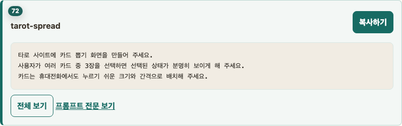

카드 뽑기 화면은 타로 사이트의 핵심 재미입니다.  
카드가 뒤집혀 있거나, 선택할 수 있는 상태처럼 보여야 합니다.

> 프롬프트 박스: tarot-spread
> 표시: 앞 3줄 미리보기
> 버튼: 복사하기

독자 행동 안내: 카드 뽑기 화면을 만들어 달라고 요청해 주세요.

### 11페이지. 카드 뽑기 결과 확인

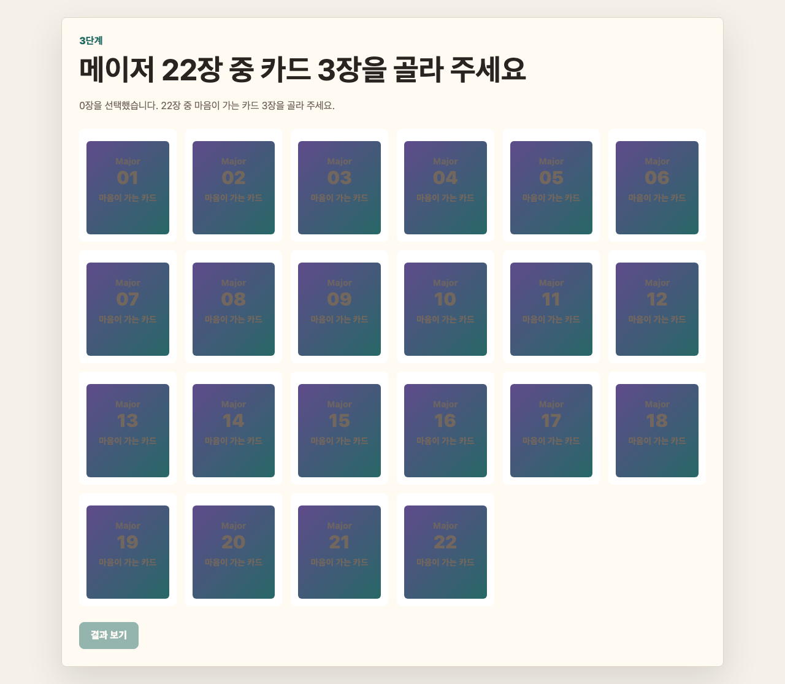

카드는 손가락으로 누르기 쉬운 크기여야 합니다.  
너무 작거나 너무 붙어 있으면 다시 넓혀 달라고 부탁합니다.

독자 행동 안내: 카드가 3장 이상 선택될 수 있는 흐름인지 확인해 주세요.

### 12페이지. 카드 3장 선택 완료 확인

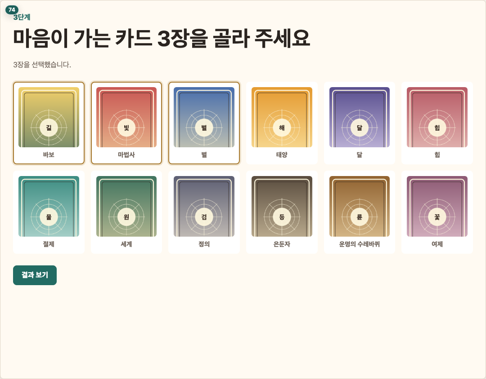

카드를 선택하면 선택된 상태가 보여야 합니다.  
사용자가 “내가 무엇을 눌렀는지” 알 수 있어야 다음 단계로 넘어갈 수 있습니다.

독자 행동 안내: 선택된 카드가 표시되는지 확인해 주세요.

### 13페이지. 결과 화면 만들기

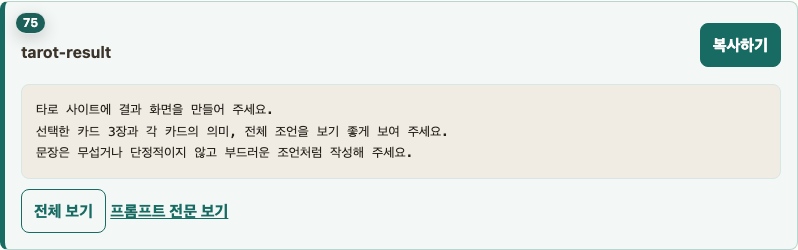

결과 화면에서는 카드 이름, 정방향과 역방향, 5영역 리딩을 보여 줍니다.  
너무 무섭거나 단정적인 문장보다 부드러운 조언처럼 읽히는 문장이 좋습니다.

> 프롬프트 박스: tarot-result
> 표시: 앞 3줄 미리보기
> 버튼: 복사하기

독자 행동 안내: 결과 화면을 만들어 달라고 ChatGPT에 요청해 주세요.

### 14페이지. 결과 화면 확인

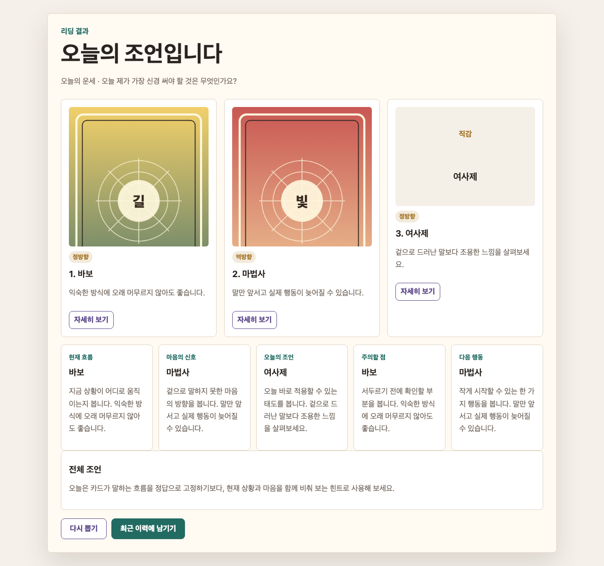

결과 화면은 이 사이트의 완성도를 결정합니다.  
카드 이미지, 카드 이름, 해석 문장, 5영역 조언이 균형 있게 보여야 합니다.

독자 행동 안내: 해석 문장이 너무 길면 짧게 정리해 달라고 부탁해 주세요.

### 15페이지. 카드 상세 보기 만들기

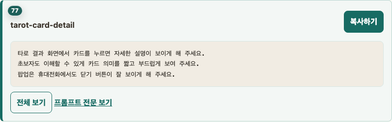

카드를 눌렀을 때 더 자세한 설명이 나오면 사이트가 더 완성도 있어 보입니다.  
하지만 처음에는 간단한 팝업 정도면 충분합니다.

> 프롬프트 박스: tarot-card-detail
> 표시: 앞 3줄 미리보기
> 버튼: 복사하기

독자 행동 안내: 카드 상세 보기를 추가해 달라고 부탁해 주세요.

### 16페이지. 카드 상세 팝업 확인

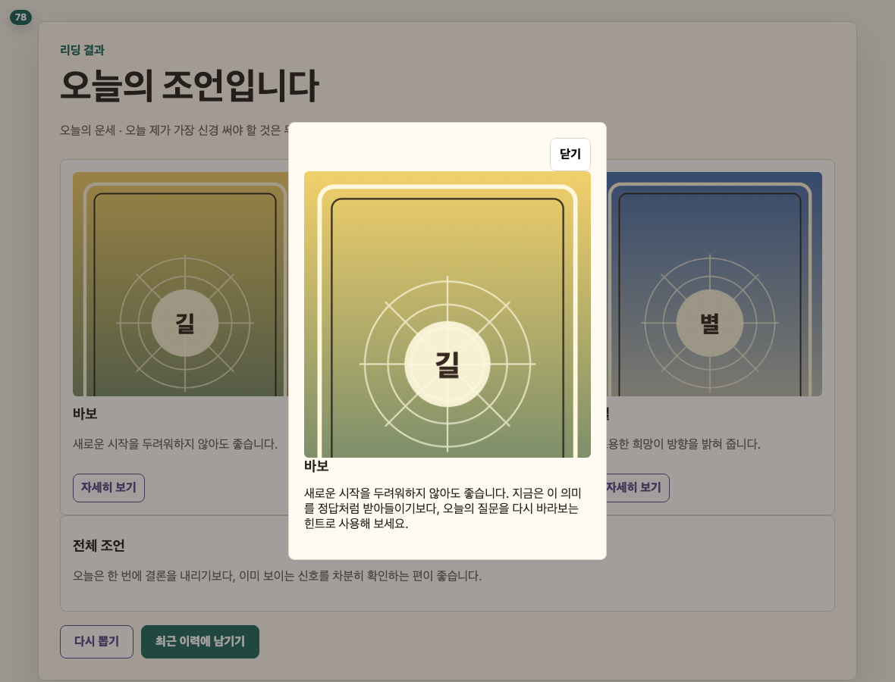

팝업은 닫기 버튼이 잘 보여야 합니다.  
휴대전화에서 화면을 가득 덮더라도 다시 돌아갈 수 있어야 합니다.

독자 행동 안내: 닫기 버튼이 보이는지 확인해 주세요.

### 17페이지. 최근 이력 화면 만들기

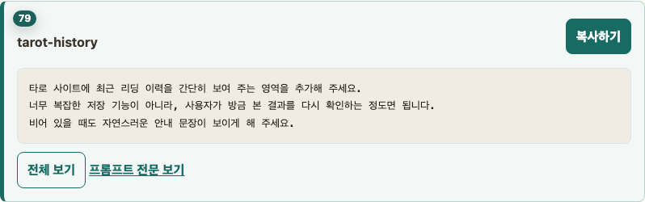

최근 이력은 사용자가 이전 리딩을 다시 볼 수 있게 하는 보강 기능입니다.  
필수는 아니지만 책 분량과 사이트 완성도를 높이는 데 도움이 됩니다.

> 프롬프트 박스: tarot-history
> 표시: 앞 3줄 미리보기
> 버튼: 복사하기

독자 행동 안내: 최근 이력 기능을 간단히 추가해 달라고 요청해 주세요.

### 18페이지. 최근 이력 결과 확인

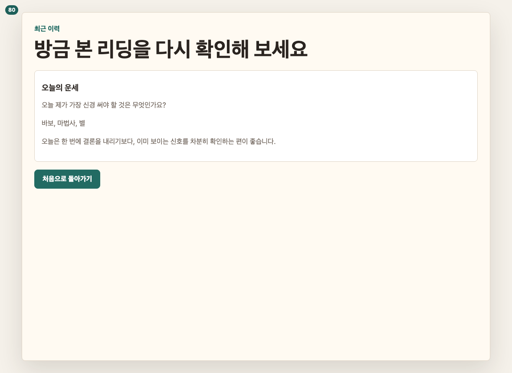

최근 이력은 너무 복잡하지 않아야 합니다.  
최근 5건 안에서 날짜, 주제, 짧은 결과 정도만 보여도 충분합니다.

독자 행동 안내: 이력이 비어 있을 때 안내 문장이 보이는지 확인해 주세요.

### 19페이지. 휴대전화 화면에 맞게 다듬기

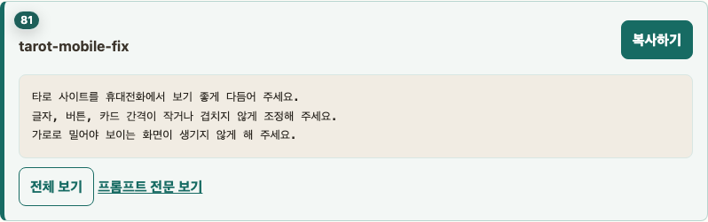

컴퓨터 화면에서 좋아 보여도 휴대전화에서는 글자가 작거나 버튼이 붙어 보일 수 있습니다.  
이때 ChatGPT에게 모바일에서 보기 좋게 다듬어 달라고 부탁합니다.

> 프롬프트 박스: tarot-mobile-fix
> 표시: 앞 3줄 미리보기
> 버튼: 복사하기

독자 행동 안내: 모바일 화면 문제를 한 번에 여러 개 적어 보내도 괜찮습니다.

### 20페이지. 모바일 결과 확인

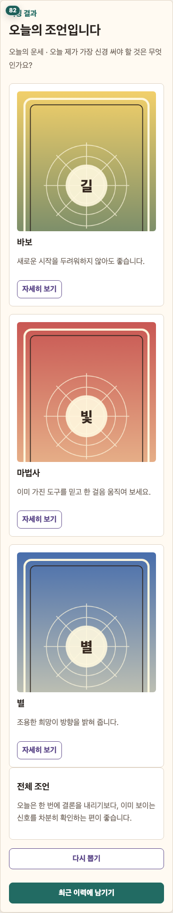

모바일 화면에서는 글자 크기, 버튼 간격, 카드 크기를 봅니다.  
화면을 좌우로 밀어야만 보인다면 다시 고쳐야 합니다.

독자 행동 안내: 모바일에서 가로 스크롤 없이 읽히는지 확인해 주세요.

### 21페이지. 결과가 다르게 나왔을 때 다시 부탁하기

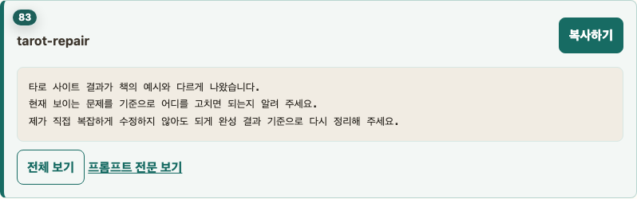

ChatGPT 결과가 책의 예시와 다를 수 있습니다.  
그럴 때는 틀린 것이 아니라 현재 결과를 기준으로 다시 부탁하면 됩니다.

> 프롬프트 박스: tarot-repair
> 표시: 앞 3줄 미리보기
> 버튼: 복사하기

독자 행동 안내: 보이는 문제를 그대로 적어 ChatGPT에게 고쳐 달라고 요청해 주세요.

### 22페이지. 타로 사이트 완성 체크

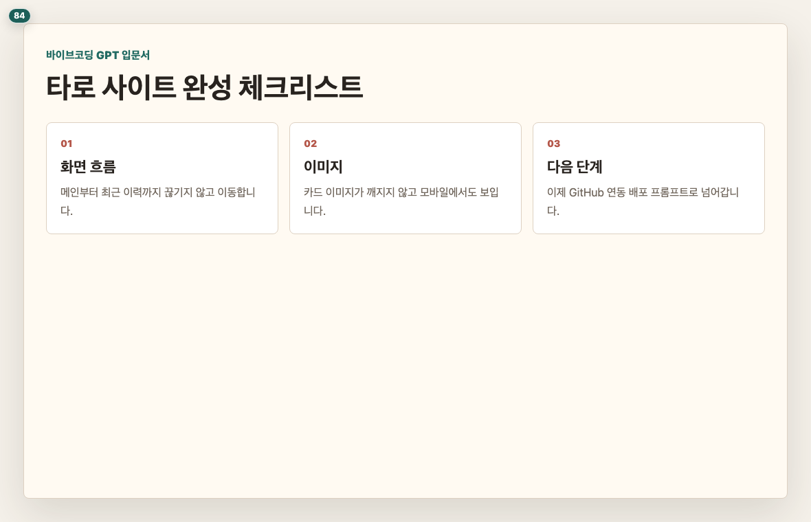

이제 타로 사이트의 주요 화면이 준비되었습니다.  
다음 장에서는 이 사이트도 GitHub Pages 주소로 열 수 있게 배포하겠습니다.

독자 행동 안내: 메인, 주제 선택, 질문 입력, 카드 뽑기, 결과 화면이 모두 있는지 확인해 주세요.

## 이 장에서 확인할 것

- [ ] 타로 사이트의 공통 디자인 방향을 정했습니다.
- [ ] 메인 화면을 만들었습니다.
- [ ] 주제 선택과 질문 입력 화면을 만들었습니다.
- [ ] 카드 뽑기와 결과 화면을 만들었습니다.
- [ ] 카드 상세 보기 또는 최근 이력 보강을 확인했습니다.
- [ ] 모바일 화면 보정을 요청했습니다.
# Chapter 7. 타로 사이트를 웹에 올리기

## 이 장의 목표

완성한 타로 사이트를 ChatGPT GitHub 연동으로 배포합니다. 첫 번째 사이트 배포와 같은 흐름을 반복하되, 타로 사이트용 새 저장소와 새 주소를 받는 데 집중합니다.

## 페이지별 원고

### 1페이지. 첫 번째 배포 흐름 복습

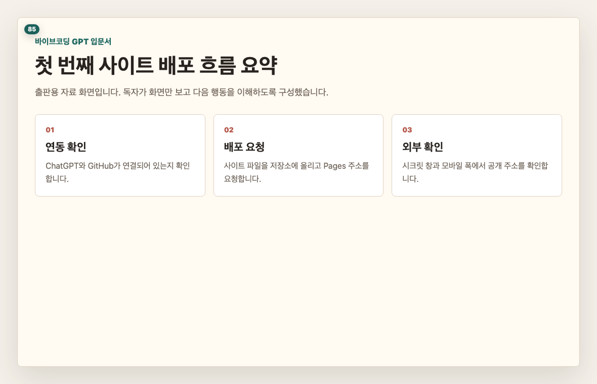

첫 번째 사이트를 올릴 때 했던 흐름을 다시 떠올립니다.  
GitHub 연결 확인, 새 저장소 요청, 파일 업로드, Pages 활성화, 주소 확인 순서입니다.

독자 행동 안내: Chapter 3에서 받은 첫 번째 사이트 주소를 떠올려 주세요.

### 2페이지. GitHub 연결 상태 확인하기

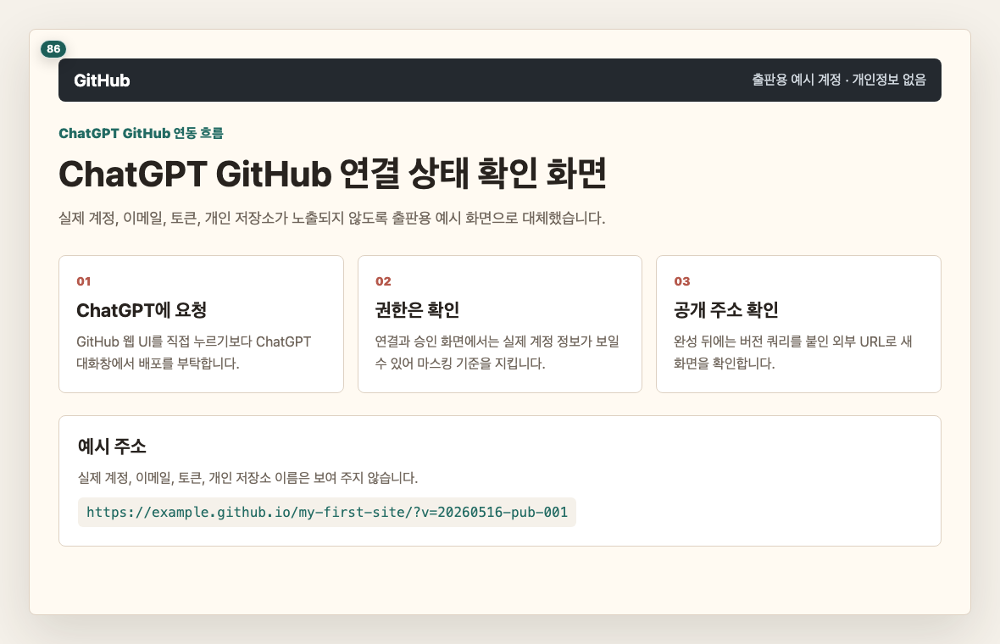

배포를 시작하기 전에 ChatGPT와 GitHub 연결 상태를 확인합니다.  
연결이 풀려 있으면 다시 연결한 뒤 진행합니다.

독자 행동 안내: GitHub 연결 상태가 보이는지 확인해 주세요.

### 3페이지. 타로 사이트용 새 저장소 요청하기

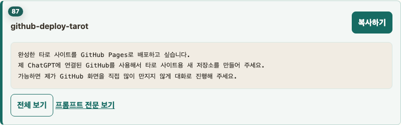

첫 번째 사이트와 타로 사이트는 서로 다른 주소로 관리하는 것이 좋습니다.  
ChatGPT에게 타로 사이트용 새 저장소를 만들어 달라고 부탁합니다.

> 프롬프트 박스: github-deploy-tarot
> 표시: 앞 3줄 미리보기
> 버튼: 복사하기

독자 행동 안내: 복사한 프롬프트를 ChatGPT에 보내 주세요.

### 4페이지. 업로드 진행 답변 기다리기

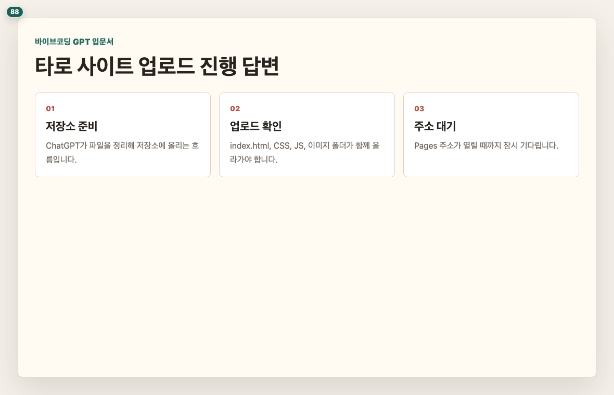

ChatGPT가 타로 사이트 파일을 정리하고 GitHub에 올리는 과정을 안내합니다.  
답변이 길어져도 정상입니다.

독자 행동 안내: 중간에 멈춘 것 같으면 잠시 기다린 뒤, 이어서 진행해 달라고 부탁해 주세요.

### 5페이지. GitHub Pages 활성화 부탁하기

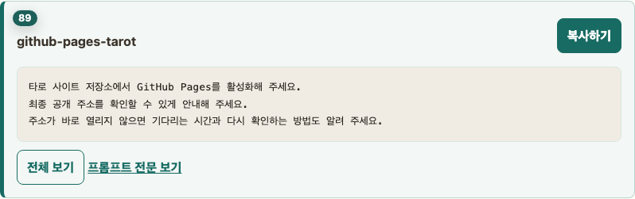

파일이 올라갔다면 웹주소로 열 수 있게 Pages 활성화를 부탁합니다.  
이 단계가 끝나야 외부에서 사이트를 열 수 있습니다.

> 프롬프트 박스: github-pages-tarot
> 표시: 앞 3줄 미리보기
> 버튼: 복사하기

독자 행동 안내: ChatGPT에게 Pages 활성화와 최종 주소 확인을 함께 부탁해 주세요.

### 6페이지. 최종 주소 확인하기

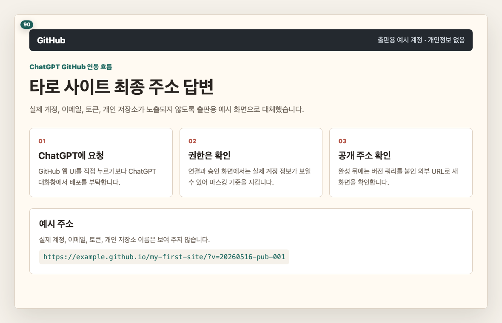

ChatGPT 답변에서 최종 주소를 찾습니다.  
주소가 바로 열리지 않으면 GitHub Pages 반영 시간이 조금 필요할 수 있습니다.

독자 행동 안내: 주소를 열고, 안 열리면 몇 분 뒤 다시 확인해 주세요.

### 7페이지. 데스크톱에서 열어 보기

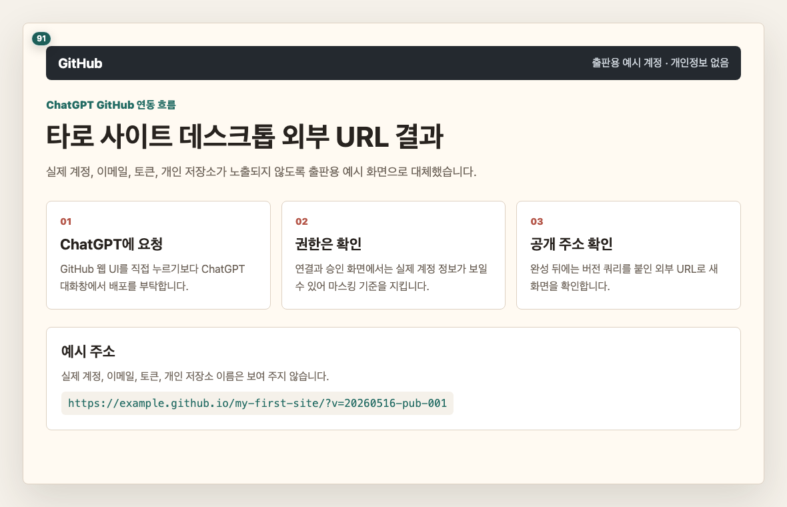

데스크톱에서 타로 사이트가 열리면 큰 성공입니다.  
이제 사이트는 ChatGPT 대화창 밖의 실제 주소에서 보입니다.

독자 행동 안내: 메인 화면이 보이고 시작 버튼이 눌릴 수 있어 보이는지 확인해 주세요.

### 8페이지. 휴대전화에서 열어 보기

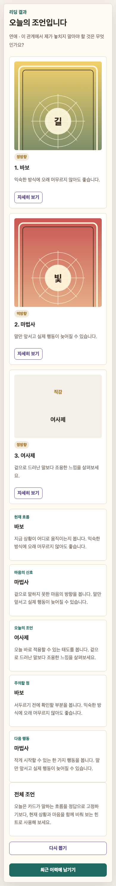

휴대전화에서도 같은 주소를 열어 봅니다.  
타로 사이트는 카드와 결과 문장이 중요하므로 모바일 가독성을 꼭 확인해야 합니다.

독자 행동 안내: 카드가 잘 보이고 결과 문장이 잘리지 않는지 확인해 주세요.

### 9페이지. 친구에게 주소 보내 보기

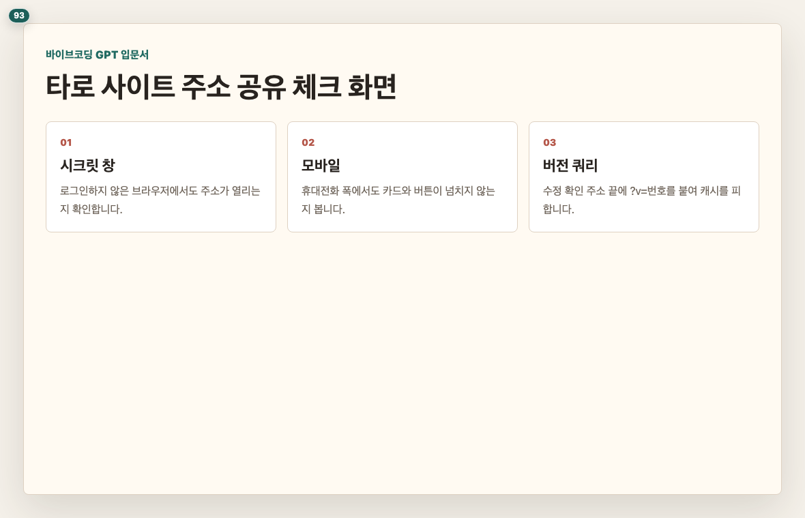

주소가 열리면 다른 사람에게도 보여 줄 수 있습니다.  
이 순간이 이 책의 두 번째 완성 경험입니다.

독자 행동 안내: 주소를 복사해 본인에게 메시지로 보내 보고 다시 열어 보세요.

## 이 장에서 확인할 것

- [ ] ChatGPT GitHub 연결 상태를 확인했습니다.
- [ ] 타로 사이트용 새 저장소 생성을 부탁했습니다.
- [ ] GitHub Pages 활성화를 부탁했습니다.
- [ ] 타로 사이트 최종 주소를 받았습니다.
- [ ] 데스크톱과 휴대전화에서 외부 주소를 열어 봤습니다.
