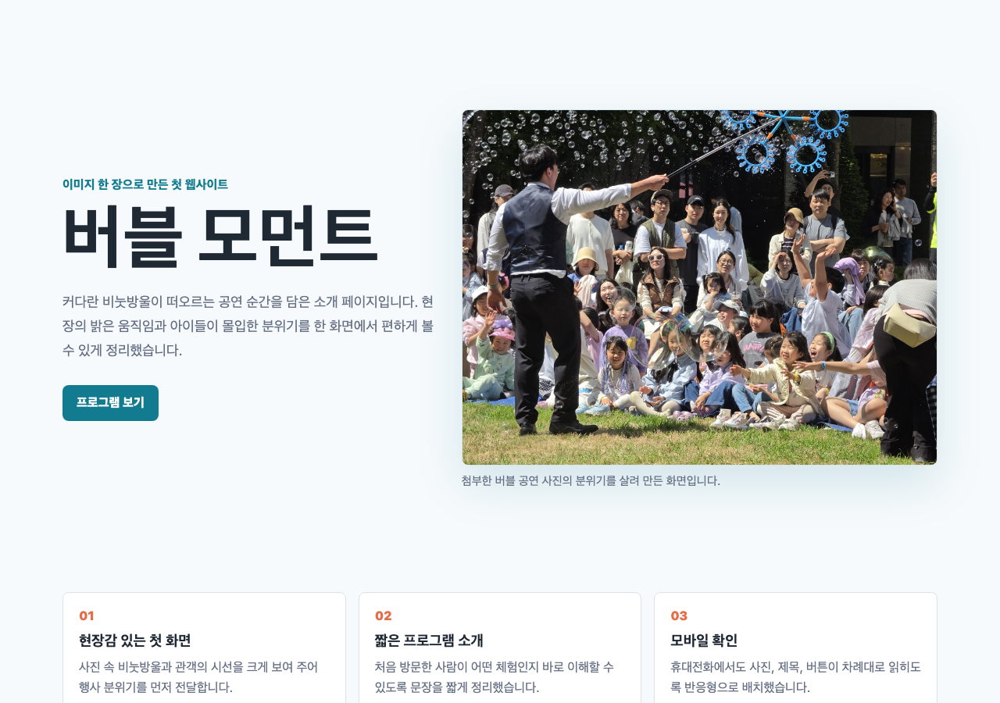
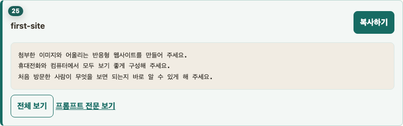
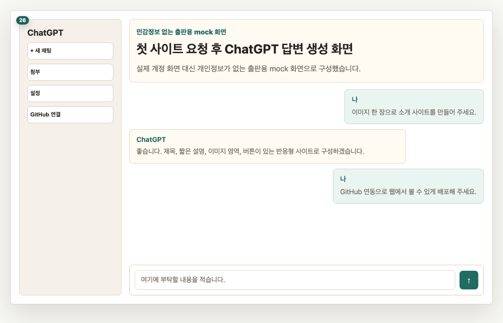
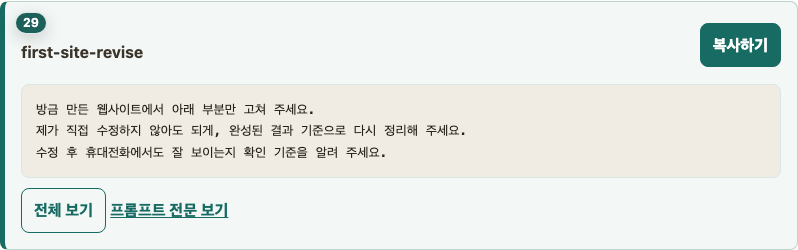
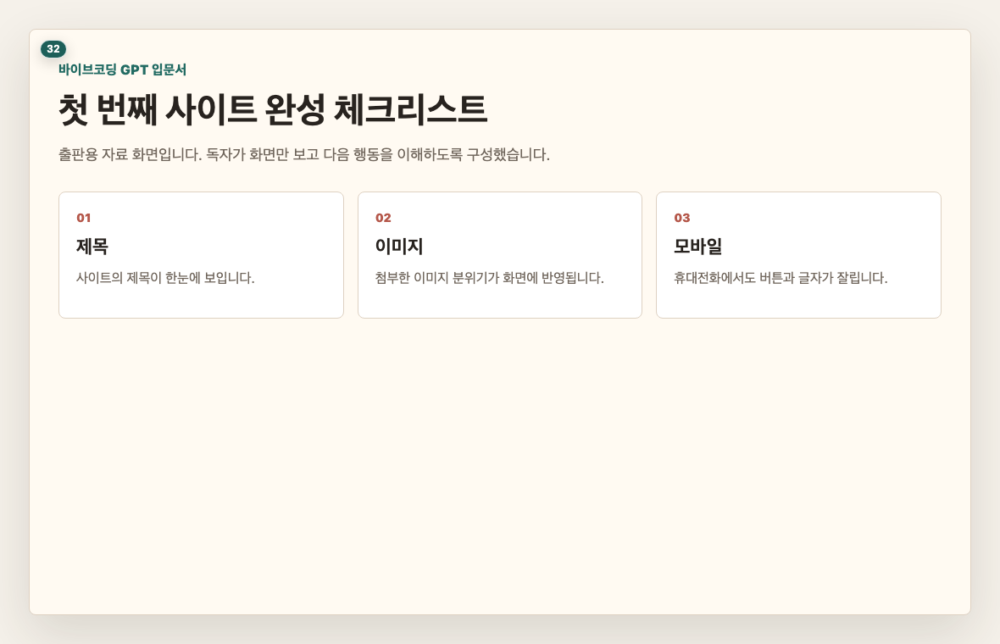

# Chapter 2. 첫 번째 사이트 만들기 - 이미지 한 장으로 웹사이트 받기

## 이 장의 목표

이미지 한 장을 ChatGPT에 올리고, 그 이미지를 바탕으로 첫 번째 웹사이트 결과를 받습니다. 이번 장의 목표는 완벽한 사이트가 아니라 “내가 부탁해서 화면이 만들어졌다”는 첫 성취입니다.

## 페이지별 원고

### 1페이지. 먼저 완성 예시를 봅니다

이 장을 끝내면 작은 소개 페이지 하나가 생깁니다.  
사진이나 그림 한 장의 분위기를 살려 제목, 문장, 버튼이 있는 화면을 받아 보겠습니다.

독자 행동 안내: 완성 예시를 보며 내가 만들고 싶은 분위기를 떠올려 주세요.

### 2페이지. 사용할 이미지 한 장 고르기

처음에는 너무 복잡한 이미지보다 분위기가 분명한 이미지가 좋습니다.  
카페, 여행지, 제품, 포스터처럼 한눈에 느낌이 보이는 이미지를 골라 주세요.

독자 행동 안내: 실습용 이미지 한 장을 준비해 주세요.

### 3페이지. ChatGPT에 이미지 첨부하기

ChatGPT 입력창 옆의 첨부 단추를 눌러 이미지를 올립니다.  
이미지가 올라오면 입력창 근처에 작은 미리보기가 보입니다.

독자 행동 안내: 이미지가 정상적으로 붙었는지 확인한 뒤 다음 페이지로 넘어가 주세요.

### 4페이지. 첫 번째 사이트 제작 프롬프트(prompt) 복사하기

이제 ChatGPT에게 이미지를 바탕으로 웹사이트를 만들어 달라고 부탁합니다.  
본문에는 앞 3줄만 보이고, 전문은 복사하기 버튼으로 사용합니다.

> 프롬프트(prompt) 박스: first-site
> 표시: 앞 3줄 미리보기
> 버튼: 복사하기

독자 행동 안내: 복사하기 버튼을 누른 뒤 ChatGPT 입력창에 붙여 넣고 보내 주세요.

### 5페이지. ChatGPT 답변 기다리기

ChatGPT가 결과를 만드는 동안 잠시 기다립니다.  
답변이 길게 나오더라도 정상입니다.

독자 행동 안내: 답변이 끝날 때까지 같은 프롬프트(prompt)를 다시 보내지 마세요.

### 6페이지. 결과가 나온 상태 확인하기

답변이 끝나면 ChatGPT가 만든 결과를 확인합니다.  
이때 코드처럼 보이는 내용이 나와도 직접 외우거나 고칠 필요는 없습니다.

독자 행동 안내: ChatGPT가 “완성 파일” 또는 “미리보기”에 해당하는 결과를 줬는지만 확인해 주세요.

### 7페이지. 첫 결과 화면 보기

첫 결과 화면이 보이면 성공입니다.  
아직 디자인이 마음에 꼭 들지 않아도 괜찮습니다. 다음 단계에서 말로 고치면 됩니다.

독자 행동 안내: 화면에서 제목, 이미지, 버튼이 보이는지 확인해 주세요.

### 8페이지. 마음에 안 드는 부분을 한 줄로 고치기

수정은 어렵게 말하지 않아도 됩니다.  
“글자를 조금 크게 해 주세요”, “배경을 더 밝게 해 주세요”처럼 한 줄로 부탁하면 됩니다.

> 프롬프트(prompt) 박스: first-site-revise
> 표시: 앞 3줄 미리보기
> 버튼: 복사하기

독자 행동 안내: 마음에 안 드는 부분 하나만 골라 수정 요청을 보내 주세요.

### 9페이지. 수정 후 결과 비교하기

수정 요청 뒤에는 결과가 어떻게 달라졌는지 봅니다.  
바이브코딩(vibe coding)은 한 번에 맞히는 작업이 아니라, 보면서 조금씩 맞춰 가는 작업입니다.

독자 행동 안내: 수정 전보다 좋아진 부분 하나를 찾아보세요.

### 10페이지. 휴대전화 화면 확인하기

웹사이트는 컴퓨터에서만 예쁘면 부족합니다.  
휴대전화에서도 글자가 잘 보이고 버튼을 누를 수 있어야 합니다.

독자 행동 안내: 모바일(mobile) 화면에서 제목과 버튼이 잘리지 않는지 확인해 주세요.

### 11페이지. 첫 번째 사이트 완성 체크

첫 번째 사이트는 아직 내 컴퓨터 또는 ChatGPT 대화 안에서 확인한 상태입니다.  
다음 장에서는 이 결과를 실제 인터넷 주소로 열 수 있게 올려 보겠습니다.

독자 행동 안내: 결과 화면을 확인했다면 다음 장으로 넘어가 주세요.

## 이 장에서 확인할 것

- [ ] 이미지 한 장을 ChatGPT에 첨부했습니다.
- [ ] 첫 사이트 제작 프롬프트(prompt)를 복사해 보냈습니다.
- [ ] 첫 웹사이트 결과 화면을 확인했습니다.
- [ ] 한 줄 수정 요청을 보내 봤습니다.
- [ ] 모바일(mobile) 화면 확인이 필요하다는 점을 이해했습니다.
