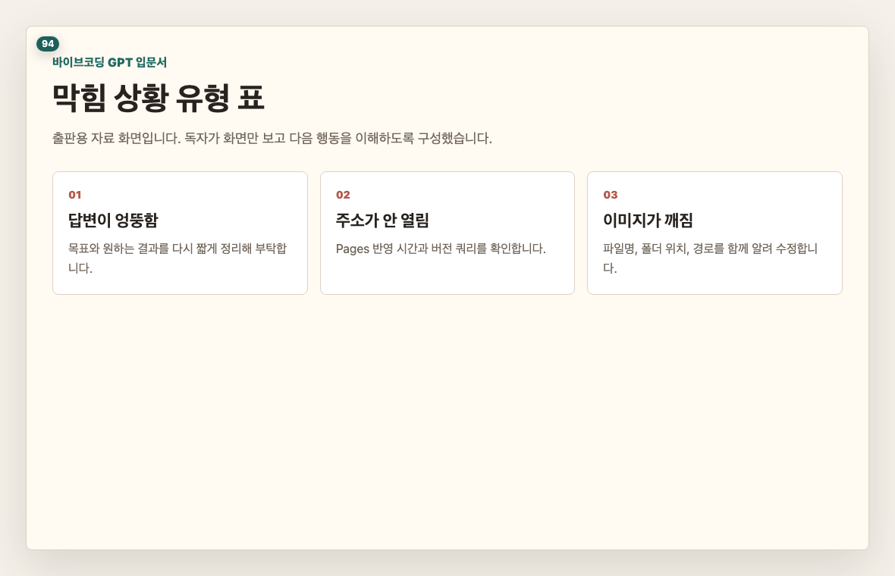
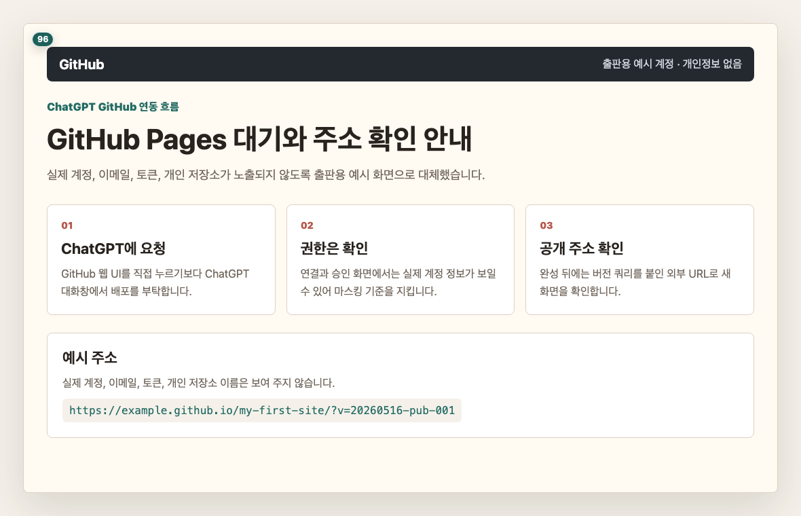
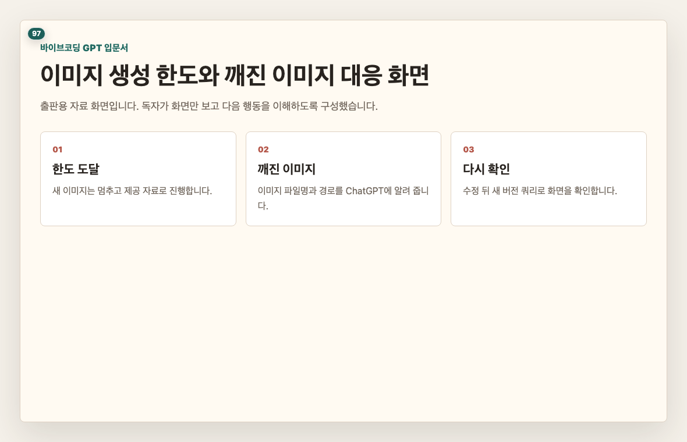
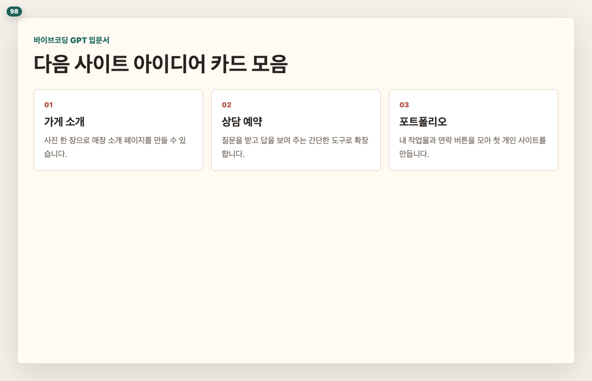

# 부록. 막혔을 때 다시 부탁하는 문장

## 이 장의 목표

실습 중 자주 막히는 상황에서 ChatGPT에게 다시 부탁하는 흐름을 정리합니다. 본문에는 프롬프트 앞 3줄만 보이고, 복사하기 버튼으로 전문을 보낼 수 있습니다.

## 페이지별 원고

### 1페이지. 막힘 상황을 먼저 고릅니다

막혔을 때는 당황해서 처음부터 다시 시작하기 쉽습니다.  
하지만 대부분은 현재 상황을 ChatGPT에게 설명하면 이어서 고칠 수 있습니다.

독자 행동 안내: 먼저 내가 어디서 막혔는지 표에서 골라 주세요.

### 2페이지. ChatGPT가 엉뚱한 답을 줄 때

ChatGPT가 책과 다른 방향으로 답할 수 있습니다.  
그럴 때는 “책의 목표는 이것입니다”라고 다시 기준을 알려 주면 됩니다.

> 프롬프트 박스: repair-wrong-answer
> 표시: 앞 3줄 미리보기
> 버튼: 복사하기

독자 행동 안내: 현재 답변에서 마음에 들지 않는 부분을 한 문장으로 함께 적어 주세요.

### 3페이지. GitHub Pages 주소가 안 뜰 때

GitHub Pages는 주소가 바로 열리지 않을 때가 있습니다.  
잠시 기다려야 하는 경우와 설정을 다시 확인해야 하는 경우를 나누어 봐야 합니다.

> 프롬프트 박스: repair-pages-url
> 표시: 앞 3줄 미리보기
> 버튼: 복사하기

독자 행동 안내: ChatGPT에게 현재 보이는 화면과 마지막 답변을 함께 설명해 주세요.

주소가 열렸다면 데스크톱, 휴대전화, 시크릿 창에서 한 번씩 확인합니다. 사용자가 리모트 환경에서 직접 확인하기 어렵다면 작업자가 배포 URL을 열어 보고 화면 상태를 함께 보고해야 합니다.

### 4페이지. 이미지 한도와 깨짐 대응

이미지 생성 한도가 부족하거나 카드 이미지가 깨질 수 있습니다.  
이때는 무리해서 계속 생성하지 말고, 제공 자료를 사용하거나 경로를 다시 확인합니다.

> 프롬프트 박스: repair-image-broken
> 표시: 앞 3줄 미리보기
> 버튼: 복사하기

독자 행동 안내: 깨진 화면이 보이면 캡처하거나 상황을 적어 ChatGPT에게 전달해 주세요.

### 5페이지. 다음에 만들어 볼 수 있는 사이트

첫 사이트와 타로 사이트를 완성했다면, 이제 다른 주제로 바꿔 볼 수 있습니다.  
가게 소개, 포트폴리오, 행사 안내, 제품 소개처럼 이미지를 중심으로 만든 사이트가 다음 실습에 좋습니다.

> 프롬프트 박스: next-site-ideas
> 표시: 앞 3줄 미리보기
> 버튼: 복사하기

독자 행동 안내: 다음에 만들고 싶은 사이트 주제 하나를 적어 보세요.

## 이 장에서 확인할 것

- [ ] 막혔을 때 처음부터 다시 시작하지 않아도 된다는 점을 확인했습니다.
- [ ] ChatGPT 답변이 틀어지면 기준을 다시 알려 주면 된다는 점을 이해했습니다.
- [ ] GitHub Pages 주소는 반영 시간이 걸릴 수 있다는 점을 확인했습니다.
- [ ] 이미지 한도와 깨짐 대응은 제공 자료와 재요청으로 해결한다는 점을 확인했습니다.
- [ ] 다음에 만들 사이트 아이디어를 하나 떠올렸습니다.
