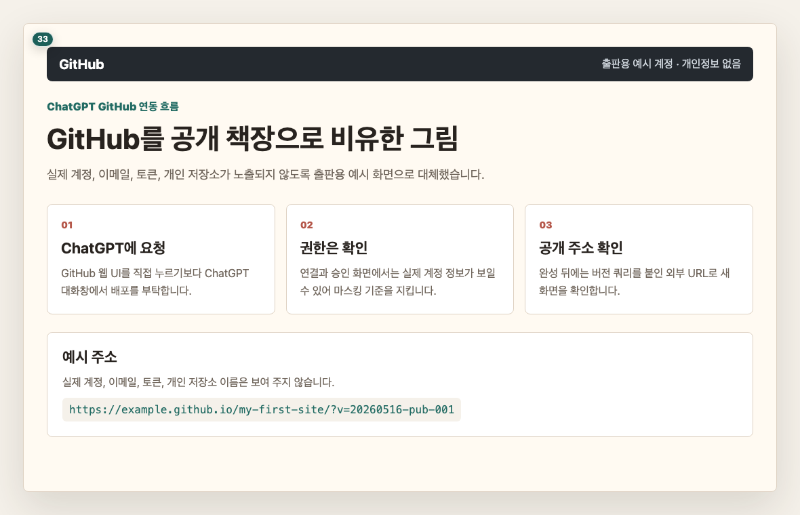
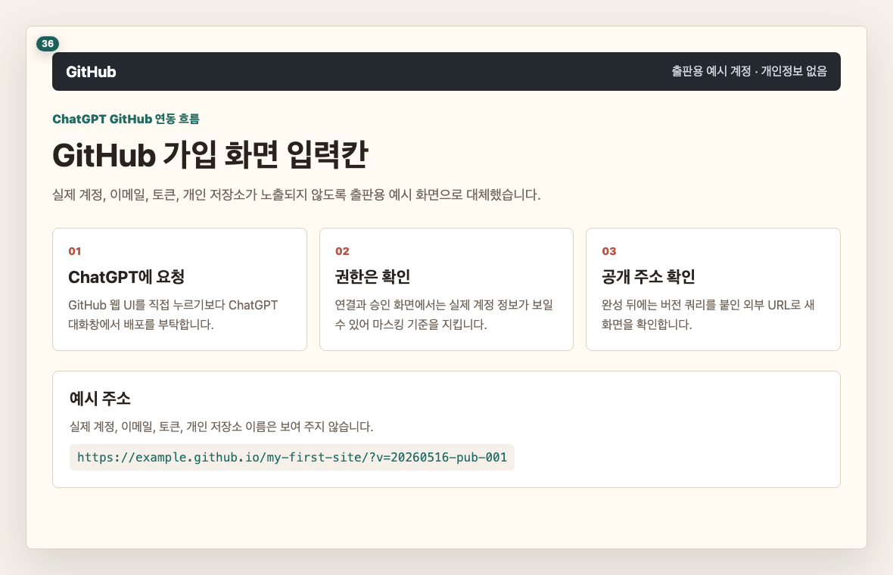
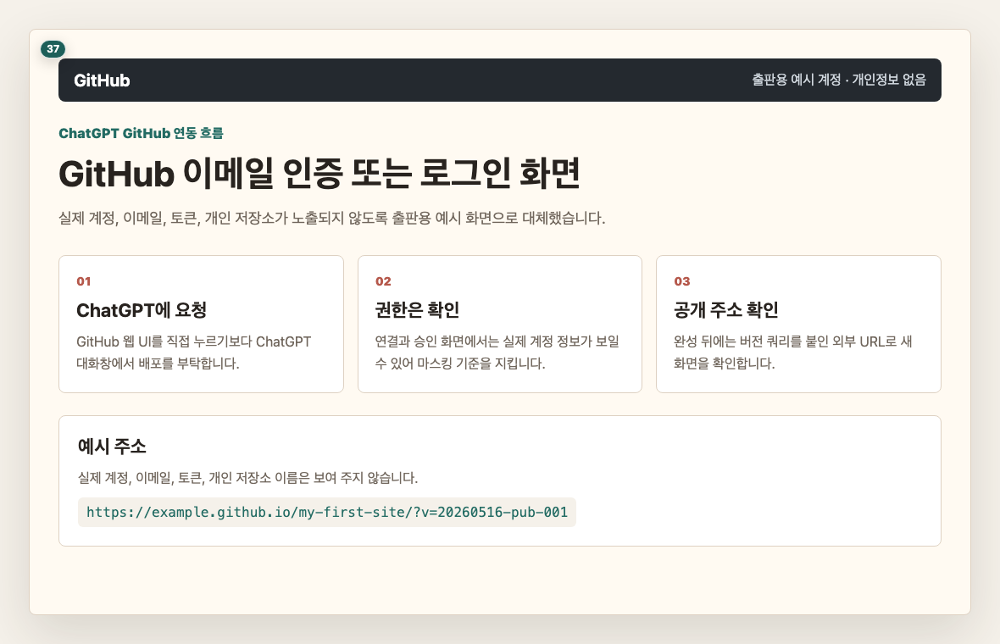
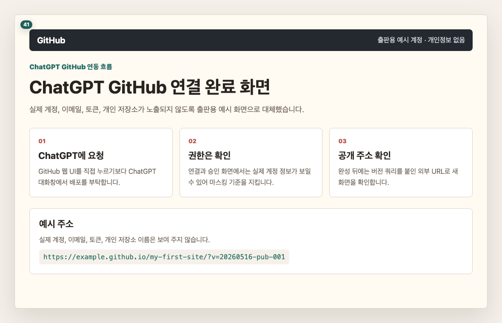
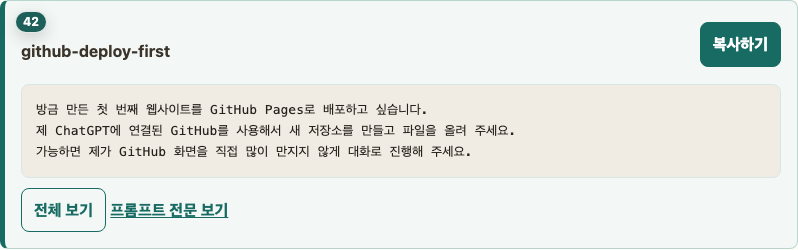
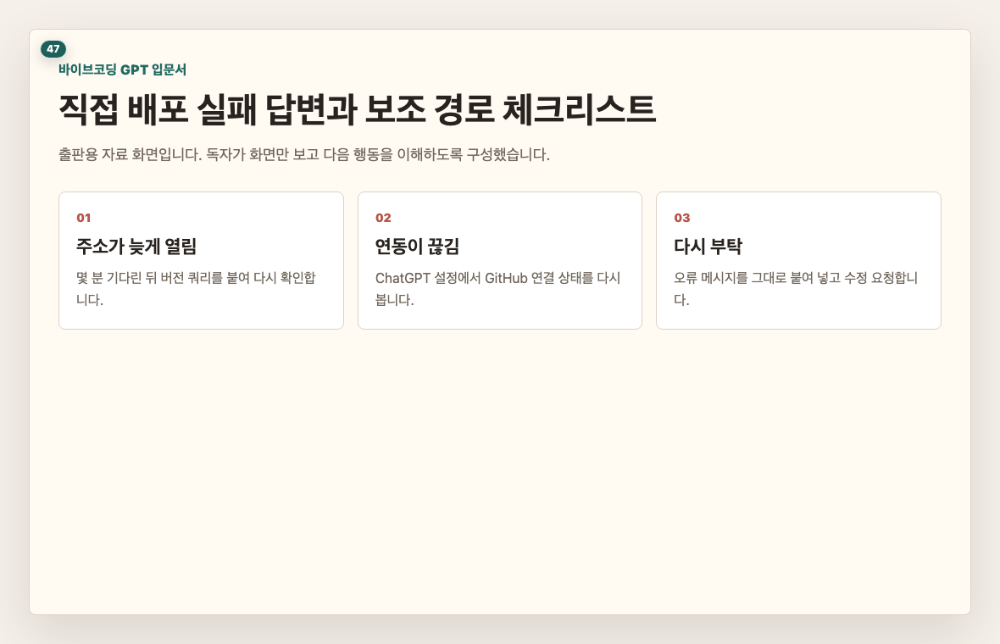

# Chapter 3. 첫 번째 사이트를 웹에 올리기

## 이 장의 목표

첫 번째 사이트를 GitHub Pages로 올려 외부 주소에서 열어 봅니다. 중심 흐름은 GitHub 화면을 직접 많이 만지는 방식이 아니라, ChatGPT에 GitHub를 연동한 뒤 대화로 배포를 부탁하는 방식입니다.

## 페이지별 원고

### 1페이지. 왜 GitHub를 쓰나요

GitHub는 만든 파일을 올려 두고 웹주소로 열 수 있게 도와주는 공간입니다.  
처음에는 어렵게 느껴져도, 이 책에서는 ChatGPT에게 연결해서 부탁하는 흐름으로 사용합니다.

독자 행동 안내: GitHub를 “사이트를 올려 두는 공개 책장” 정도로만 이해해 주세요.

### 2페이지. GitHub 메인 화면 들어가기

먼저 GitHub 사이트에 들어갑니다.  
처음 보는 화면이라도 가입 또는 로그인 버튼만 찾으면 됩니다.

독자 행동 안내: 화면에서 가입 또는 로그인으로 들어가는 버튼을 찾아 주세요.

### 3페이지. 가입 또는 로그인 버튼 찾기

계정이 없으면 가입을, 이미 계정이 있으면 로그인을 선택합니다.  
GitHub는 영어 화면이 많지만, 이 책에서는 눌러야 할 자리만 번호로 안내합니다.

독자 행동 안내: 본인 상태에 맞게 가입 또는 로그인을 선택해 주세요.

### 4페이지. GitHub 가입 화면

가입 화면에서는 이메일, 비밀번호, 사용자 이름을 입력합니다.  
사용자 이름은 나중에 주소 일부에 보일 수 있으니 너무 복잡하지 않게 정합니다.

독자 행동 안내: 입력을 마친 뒤 다음 단계로 진행해 주세요.

### 5페이지. 이메일 인증 또는 로그인 확인

GitHub는 이메일 인증을 요구할 수 있습니다.  
인증 메일이 오면 안내에 따라 확인하고 다시 로그인합니다.

독자 행동 안내: GitHub에 로그인된 상태가 되면 다음 페이지로 넘어가 주세요.

### 6페이지. ChatGPT에서 GitHub 연동 위치 찾기

이제 ChatGPT로 돌아옵니다.  
설정 또는 커넥터 메뉴에서 GitHub 연결을 찾습니다.

독자 행동 안내: 화면에서 GitHub 연결로 들어가는 위치를 찾아 주세요.

### 7페이지. GitHub 커넥터 선택하기

커넥터 목록에서 GitHub를 선택합니다.  
이 연결을 통해 ChatGPT가 사이트 파일을 저장소에 올릴 수 있게 됩니다.

독자 행동 안내: GitHub 연결 버튼을 눌러 주세요.

### 8페이지. GitHub 권한 승인하기

권한 승인 화면은 낯설 수 있습니다.  
이 책 실습에서는 새 사이트를 만들고 올리기 위해 필요한 권한을 허용하는 단계입니다.

독자 행동 안내: 개인 자료가 들어 있는 저장소가 걱정된다면 새 실습용 계정으로 진행해도 됩니다.

### 9페이지. 연결 완료 확인하기

연결이 끝나면 ChatGPT에서 GitHub가 연결된 상태로 보입니다.  
이제부터는 ChatGPT에게 저장소 생성과 배포를 부탁할 수 있습니다.

독자 행동 안내: 연결 완료 표시를 확인해 주세요.

### 10페이지. 첫 사이트 배포 요청하기

이제 첫 번째 사이트를 GitHub Pages에 올려 달라고 ChatGPT에게 부탁합니다.  
프롬프트(prompt) 전문은 복사하기 버튼으로 사용합니다.

> 프롬프트(prompt) 박스: github-deploy-first
> 표시: 앞 3줄 미리보기
> 버튼: 복사하기

독자 행동 안내: 복사한 뒤 ChatGPT 입력창에 붙여 넣고 보내 주세요.

### 11페이지. ChatGPT 진행 답변 기다리기

배포 과정은 시간이 조금 걸릴 수 있습니다.  
ChatGPT가 저장소를 만들고 파일을 올리고 Pages 설정을 안내하거나 진행합니다.

독자 행동 안내: 답변이 끝날 때까지 기다린 뒤, 최종 주소가 나오는지 확인해 주세요.

### 12페이지. 최종 주소 받기

성공하면 ChatGPT 답변 안에 웹주소가 보입니다.  
보통 `https://...github.io/...` 형태의 주소입니다.

독자 행동 안내: 주소를 눌러 새 창에서 열어 주세요.

### 13페이지. 데스크톱(desktop)에서 외부 주소 열기

주소가 열리고 첫 번째 사이트가 보이면 배포 성공입니다.  
이제 결과는 내 컴퓨터 안이 아니라 인터넷 주소로 열립니다.

독자 행동 안내: 주소창에 GitHub Pages 주소가 보이는지 확인해 주세요.

### 14페이지. 휴대전화에서 외부 주소 열기

같은 주소를 휴대전화에서도 열어 봅니다.  
휴대전화에서 잘 보이면 다른 사람에게도 보여 줄 수 있는 상태에 가까워집니다.

독자 행동 안내: 휴대전화에서 제목, 이미지, 버튼이 잘 보이는지 확인해 주세요.

### 15페이지. 연동이 막힐 때 보조 경로

계정 상태, 요금제, 권한에 따라 ChatGPT가 직접 배포를 끝내지 못할 수 있습니다.  
그럴 때는 실패가 아니라 보조 경로로 넘어가는 상황입니다.

> 프롬프트(prompt) 박스: github-deploy-first-retry
> 표시: 앞 3줄 미리보기
> 버튼: 복사하기

독자 행동 안내: ChatGPT에게 현재 막힌 지점과 다음에 눌러야 할 위치를 다시 설명해 달라고 부탁해 주세요.

## 이 장에서 확인할 것

- [ ] GitHub 계정을 만들거나 로그인했습니다.
- [ ] ChatGPT에서 GitHub를 연결했습니다.
- [ ] ChatGPT에게 첫 사이트 배포를 부탁했습니다.
- [ ] GitHub Pages 주소를 받았습니다.
- [ ] 데스크톱(desktop)과 휴대전화에서 외부 주소를 열어 봤습니다.
