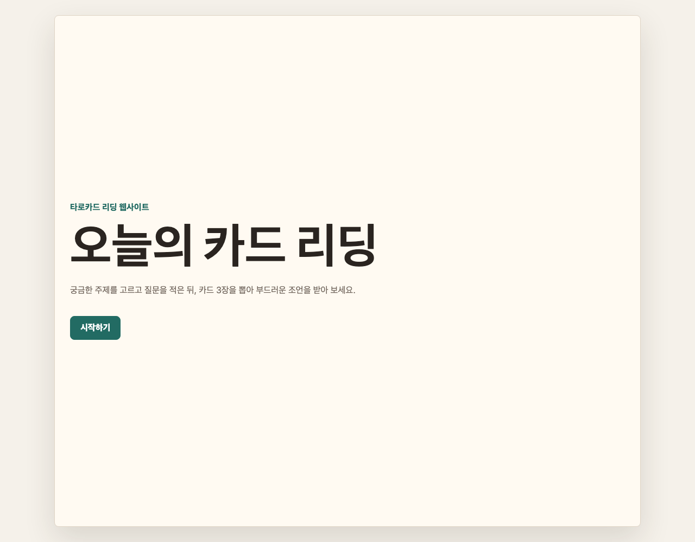
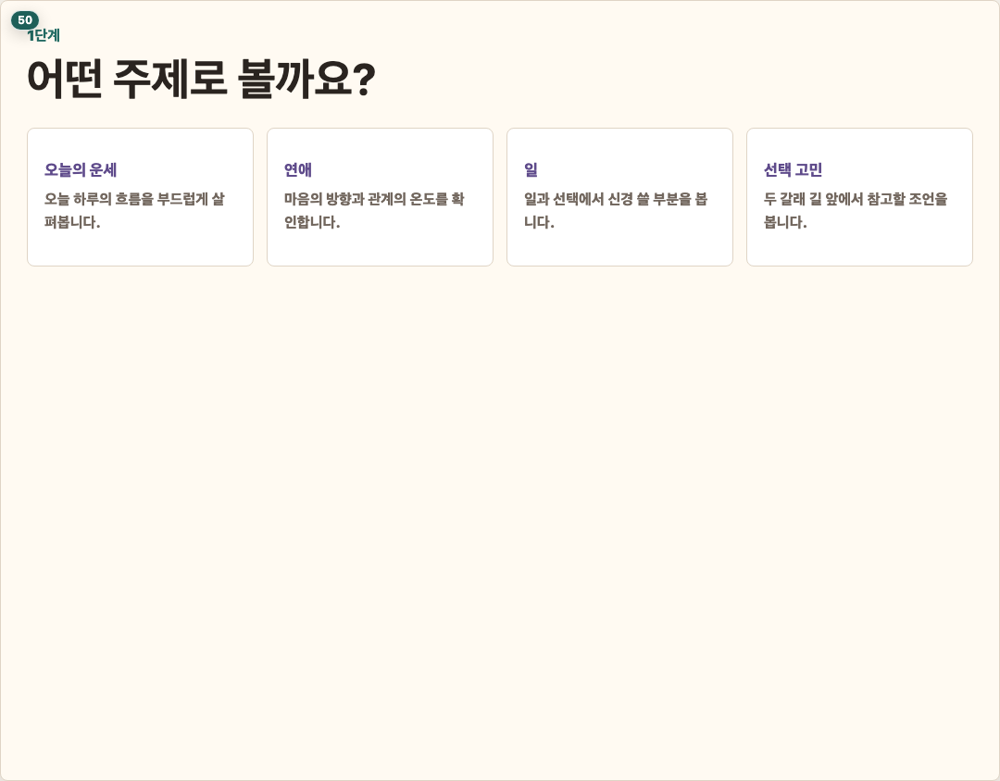
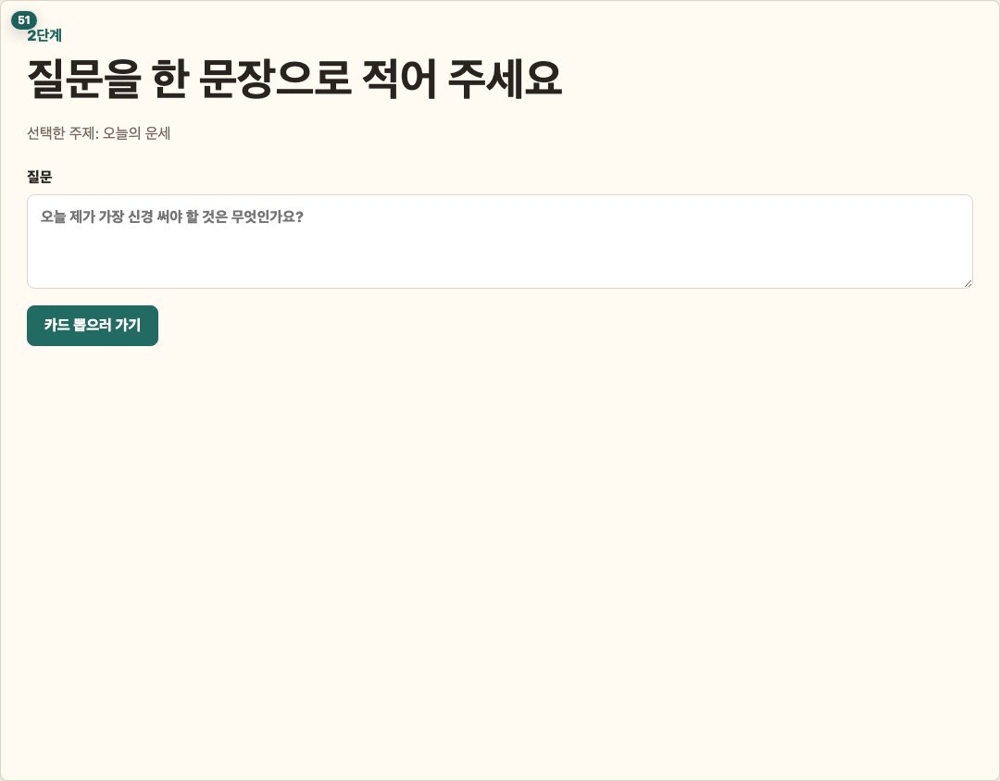
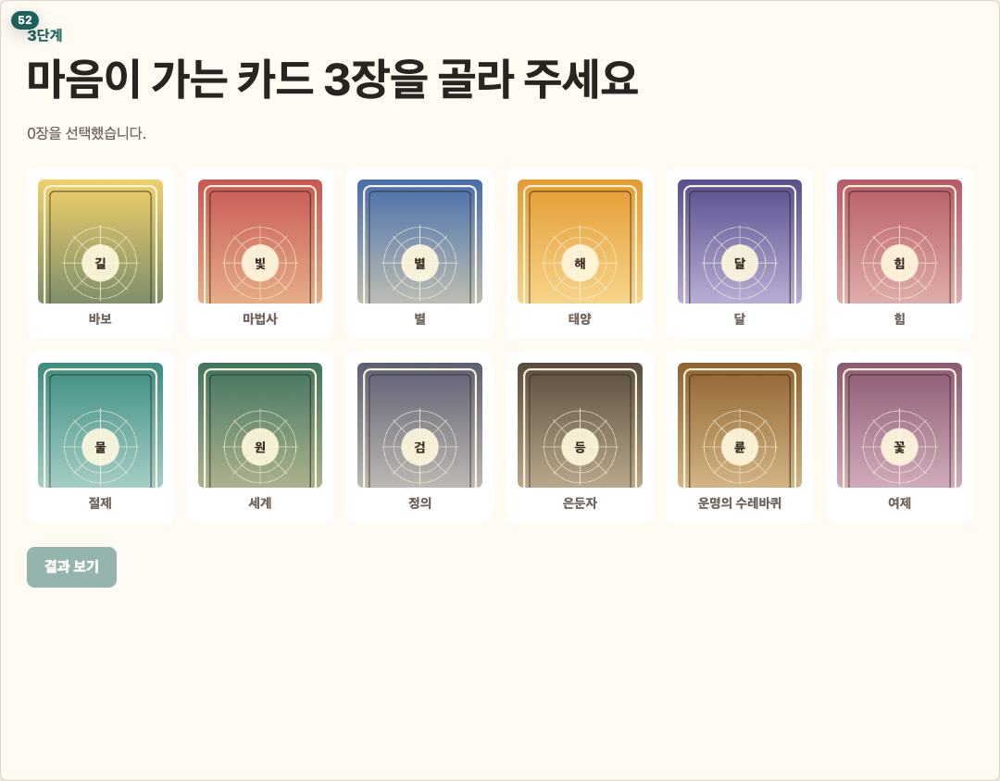
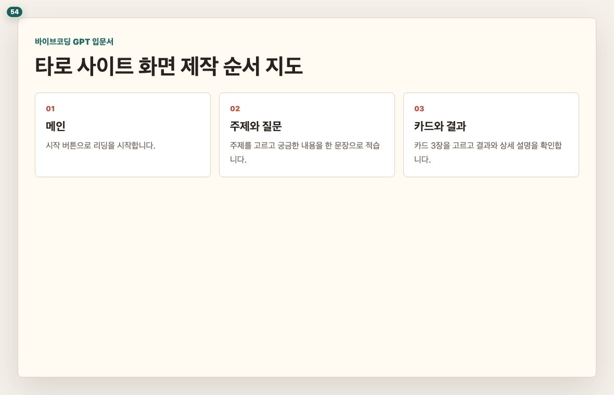

# Chapter 4. 두 번째 실습 준비 - 타로(tarot) 사이트는 어떻게 생겼나요

## 이 장의 목표

타로(tarot) 사이트를 만들기 전에 완성 화면과 사용자 흐름을 먼저 봅니다. 독자가 만들 결과를 알고 시작해야 긴 실습을 안정적으로 따라갈 수 있습니다.

## 페이지별 원고

### 1페이지. 타로(tarot) 사이트 완성 화면 미리보기

두 번째 실습에서는 타로(tarot)카드 리딩 사이트를 만듭니다.  
사용자가 주제를 고르고, 질문을 적고, 카드를 뽑으면 결과를 보여 주는 흐름입니다.

독자 행동 안내: 지금은 기능을 외우지 말고 전체 분위기만 봐 주세요.

### 2페이지. 메인 화면 보기

메인 화면은 사이트에 처음 들어왔을 때 보이는 자리입니다.  
무엇을 하는 사이트인지 바로 알 수 있어야 합니다.

독자 행동 안내: 제목, 짧은 설명, 시작 버튼이 보이는지 확인해 주세요.

### 3페이지. 주제 선택 화면 보기

타로(tarot) 리딩은 주제에 따라 답변 느낌이 달라집니다.  
예를 들어 오늘의 운세, 연애, 일, 선택 고민 같은 주제를 고를 수 있습니다.

독자 행동 안내: 독자가 누르기 쉬운 선택지가 몇 개 보이는지 살펴봐 주세요.

### 4페이지. 질문 입력 화면 보기

질문 입력 화면에서는 사용자가 궁금한 내용을 적습니다.  
너무 긴 질문보다 한 문장 정도가 처음에는 적당합니다.

독자 행동 안내: 입력칸과 다음 버튼이 한눈에 보이는지 확인해 주세요.

### 5페이지. 카드 뽑기 화면 보기

카드 뽑기 화면은 이 사이트에서 가장 재미있는 부분입니다.  
사용자는 카드를 고르고, 선택한 카드가 결과에 반영되는 느낌을 받습니다.

독자 행동 안내: 카드가 너무 작지 않은지, 누를 수 있어 보이는지 확인해 주세요.

### 6페이지. 결과 보기 화면 보기

결과 화면에서는 선택한 카드와 해석을 보여 줍니다.  
이 화면이 읽기 편해야 사용자가 사이트를 완성된 서비스처럼 느낍니다.

독자 행동 안내: 카드 이름, 해석 문장, 다시 보기 버튼이 보이는지 확인해 주세요.

### 7페이지. 제작 순서 지도

다음 장에서는 카드 이미지를 준비하고, 그다음 장에서 화면을 하나씩 만들겠습니다.  
완성 화면을 미리 봤으니 이제 필요한 재료를 준비할 차례입니다.

독자 행동 안내: 메인, 주제 선택, 질문 입력, 카드 뽑기, 결과 화면 순서를 기억해 주세요.

## 이 장에서 확인할 것

- [ ] 타로(tarot) 사이트가 어떤 흐름인지 확인했습니다.
- [ ] 메인 화면과 주제 선택 화면을 봤습니다.
- [ ] 질문 입력과 카드 뽑기 화면을 봤습니다.
- [ ] 결과 화면이 최종 목적지라는 점을 이해했습니다.
- [ ] 다음 장에서 카드 이미지를 준비한다는 점을 확인했습니다.
