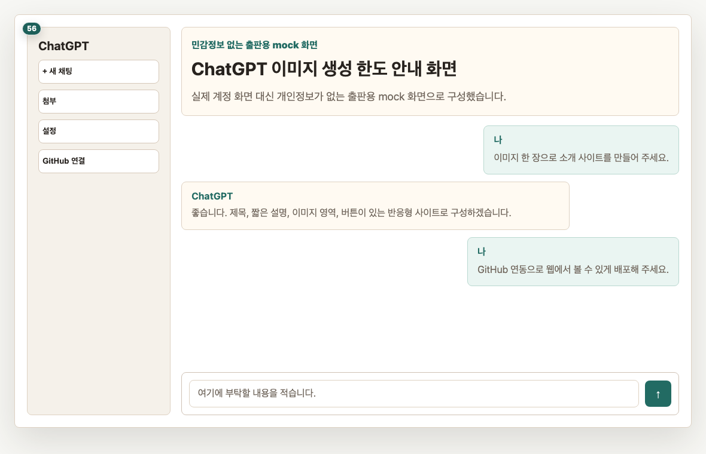
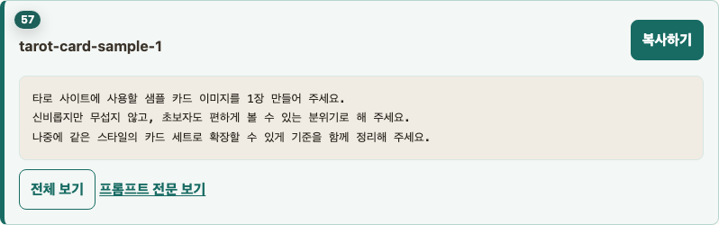
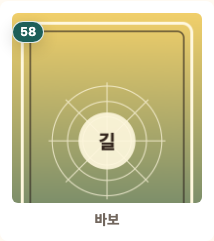
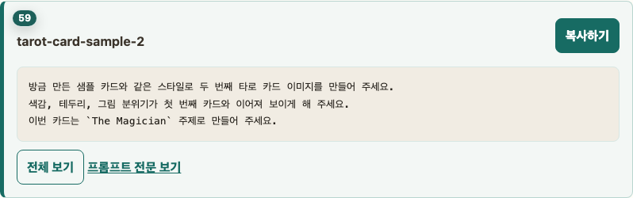
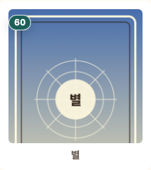
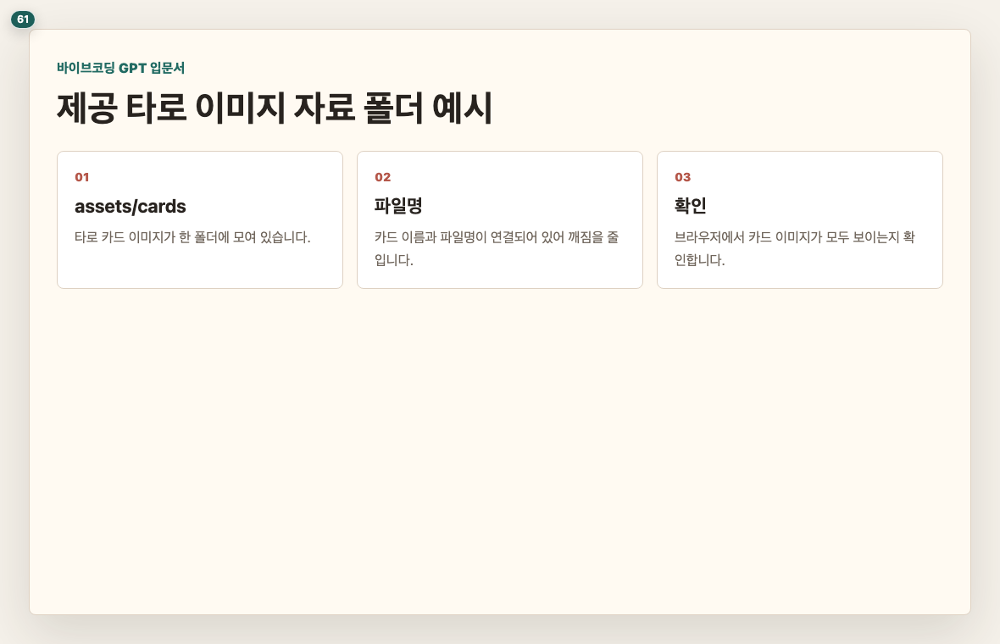
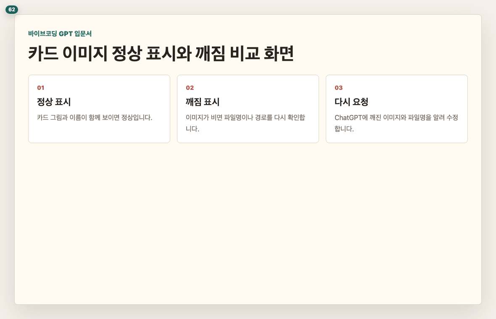

# Chapter 5. 타로(tarot)카드 이미지는 어떻게 준비하나요

## 이 장의 목표

타로(tarot) 사이트에 필요한 카드 이미지 준비 방식을 정합니다. 이미지 생성 한도 때문에 독자가 중간에 막히지 않도록, 책에서는 샘플 2장만 직접 만들어 보고 나머지는 제공 자료를 사용합니다.

## 페이지별 원고

### 1페이지. 이 책에서는 메이저 22장으로 시작합니다

타로(tarot)카드는 전체 구성이 더 넓지만, 이 책의 첫 실습은 메이저 22장으로 시작합니다.  
처음부터 모든 카드를 다루기보다, 22장 안에서 질문, 선택, 결과 흐름을 먼저 완성합니다.

독자 행동 안내: 이 책에서는 메이저 22장 기준으로 타로(tarot) 사이트의 핵심 흐름을 먼저 만든다는 점을 확인해 주세요.

### 2페이지. 이미지 생성에는 한도가 있습니다

이미지 생성은 계정 상태와 시점에 따라 사용할 수 있는 횟수가 다릅니다.  
그래서 이 책은 샘플 2장만 직접 만들어 감각을 익히고, 나머지는 제공 자료를 사용합니다.

독자 행동 안내: 이미지 생성이 막혀도 실습 전체가 멈추지 않도록 진행하겠습니다.

### 3페이지. 샘플 카드 1 만들기

첫 번째 샘플 카드는 타로(tarot) 사이트의 분위기를 잡는 용도입니다.  
프롬프트(prompt) 전문은 Phase 3에서 정리하고, 여기서는 복사 박스 자리만 둡니다.

> 프롬프트(prompt) 박스: tarot-card-sample-1
> 표시: 앞 3줄 미리보기
> 버튼: 복사하기

독자 행동 안내: 복사하기 버튼으로 프롬프트(prompt)를 보내고 결과 이미지를 기다려 주세요.

### 4페이지. 샘플 카드 1 결과 확인

결과 이미지는 완벽하지 않아도 괜찮습니다.  
분위기, 색감, 카드 테두리 느낌이 사이트와 어울리는지만 먼저 봅니다.

독자 행동 안내: 마음에 드는 부분과 아쉬운 부분을 한 가지씩 찾아보세요.

### 5페이지. 샘플 카드 2 만들기

두 번째 샘플 카드는 같은 스타일이 유지되는지 확인하는 용도입니다.  
스타일이 크게 흔들리면 나중에 카드들이 서로 다른 사이트처럼 보일 수 있습니다.

> 프롬프트(prompt) 박스: tarot-card-sample-2
> 표시: 앞 3줄 미리보기
> 버튼: 복사하기

독자 행동 안내: 두 번째 카드도 같은 분위기로 생성되는지 확인해 주세요.

### 6페이지. 샘플 카드 2 결과 확인

두 카드가 완전히 같을 필요는 없습니다.  
하지만 같은 타로(tarot) 세트처럼 보이는 정도의 통일감은 있어야 합니다.

독자 행동 안내: 두 장을 나란히 보고 색감과 테두리 스타일이 비슷한지 확인해 주세요.

### 7페이지. 나머지는 제공 자료를 사용합니다

실제 사이트에는 여러 카드 이미지가 필요합니다.  
이번 확인본은 제공된 카드 이미지와 카드 뒷면 UI(User Interface)를 함께 사용해 22장 선택 구조를 먼저 완성합니다.

독자 행동 안내: 제공 자료 폴더가 어디에 연결될 예정인지 확인해 주세요.

### 8페이지. 이미지가 깨지지 않게 확인합니다

카드 이미지가 깨져 보이면 사이트 완성도가 크게 떨어집니다.  
다음 장에서 타로(tarot) 사이트를 만들 때는 카드가 정상 표시되는지 계속 확인하겠습니다.

독자 행동 안내: 깨진 이미지 아이콘이 보이면 부록의 재요청 문장을 사용하면 됩니다.

## 이 장에서 확인할 것

- [ ] 이 책의 실습이 메이저 22장 기준으로 진행된다는 점을 확인했습니다.
- [ ] 이미지 생성 한도 때문에 샘플 2장만 직접 만든다는 점을 이해했습니다.
- [ ] 제공 자료를 사용하는 이유를 확인했습니다.
- [ ] 카드 이미지 깨짐은 출고 전 반드시 잡아야 한다는 점을 확인했습니다.
